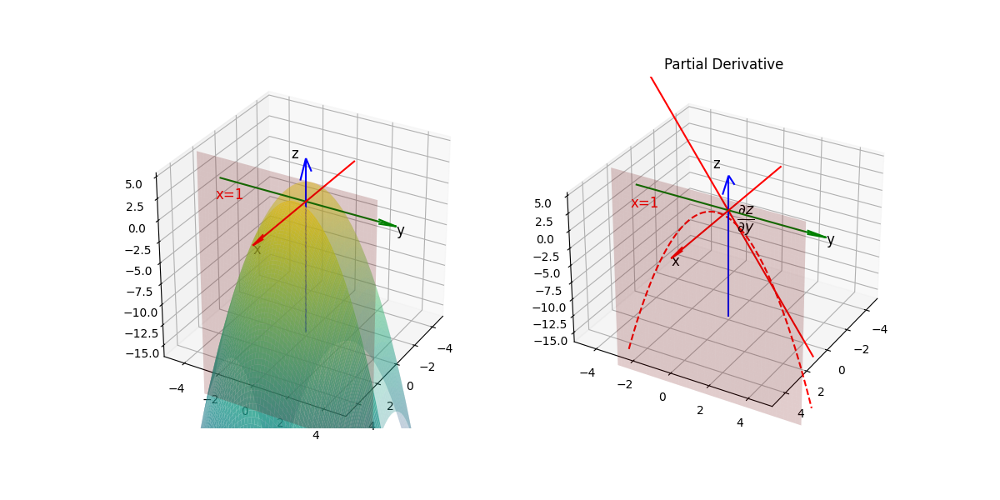

## 偏导数

### 偏导数的定义

对于多元函数 $f(x_1, x_2, \dots, x_n)$，其在点 $(a_1, a_2, \dots, a_n)$ 处关于 $x_i$ 的**偏导数**定义为：
$$
\frac{\partial f}{\partial x_i} = \lim_{h \to 0} \frac{f(a_1, \dots, a_i + h, \dots, a_n) - f(a_1, \dots, a_n)}{h}
$$
表示固定其他变量（视为常数）时，函数沿 $x_i$ 方向的变化率。

### 偏导数的计算

**步骤**：
1. 对指定变量求导
2. 将其他变量视为常数

**示例**：  
设 $f(x, y) = x^2 y + y^3$，则：
- 对 $x$ 的偏导：
$$
  \frac{\partial f}{\partial x} = 2xy
  $$
- 对 $y$ 的偏导：
$$
  \frac{\partial f}{\partial y} = x^2 + 3y^2
  $$

### 几何意义

- $\frac{\partial f}{\partial x}$ 表示曲面 $z=f(x,y)$ 在点 $(x_0, y_0)$ 处沿 $x$ 轴方向的切线斜率。
- $\frac{\partial f}{\partial y}$ 表示沿 $y$ 轴方向的切线斜率。

### 高阶偏导数

对偏导数再次求导得到高阶偏导数：

**二阶偏导数**：
$$
\frac{\partial^2 f}{\partial x^2},\quad \frac{\partial^2 f}{\partial y^2},\quad \frac{\partial^2 f}{\partial x \partial y},\quad \frac{\partial^2 f}{\partial y \partial x}
$$

**Clairaut 定理**：  
若二阶混合偏导数连续，则：
$$
\frac{\partial^2 f}{\partial x \partial y} = \frac{\partial^2 f}{\partial y \partial x}
$$
## 偏微分

**偏微分**是偏导数与自变量微分的乘积：
$$
df = \frac{\partial f}{\partial x} dx + \frac{\partial f}{\partial y} dy
$$

**示例**：  
对于 $f(x, y) = x^2 y + y^3$，全微分为：
$$
df = (2xy)dx + (x^2 + 3y^2)dy
$$

## 应用

- 梯度向量：$\nabla f = \left( \frac{\partial f}{\partial x}, \frac{\partial f}{\partial y} \right)$。

- 判断多元函数极值。

- 求解偏微分方程（如热传导方程）。

> 注意事项
> 1. 偏导数存在不一定函数连续。
> 2. 偏导数相等需要满足连续性条件。
> 3. 全微分需所有偏导数连续时才存在。
