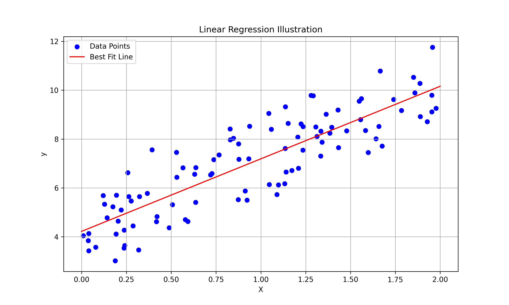
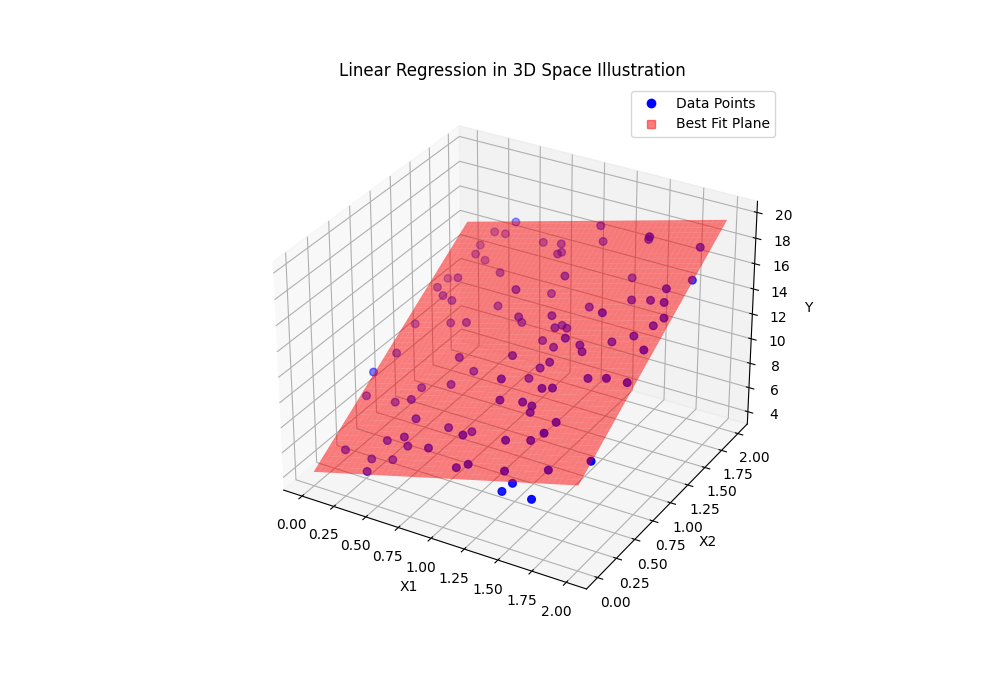
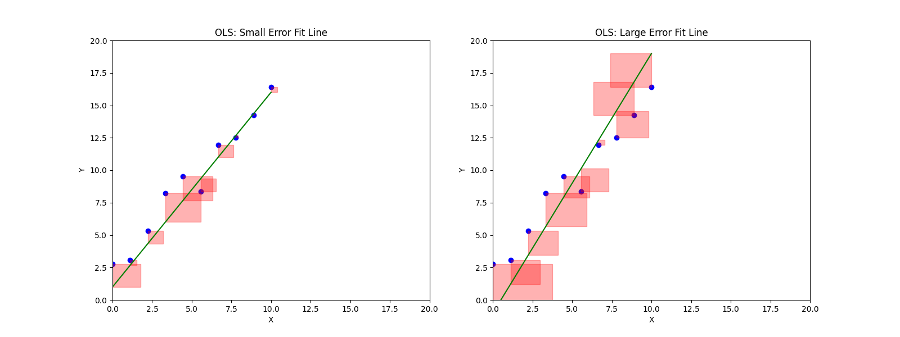

## 1. 模型定义

线性回归用于建立自变量$X$与因变量$Y$之间的**线性关系**模型：
$$ Y = \beta_0 + \beta_1 X_1 + \beta_2 X_2 + \dots + \beta_p X_p + \varepsilon $$
- $Y$: 因变量（响应变量）
- $X_i$: 自变量（特征）
- $\beta_0$: 截距项
- $\beta_j$: 第$j$个自变量的回归系数
- $\varepsilon$: 随机误差项，通常假设$\varepsilon \sim N(0, \sigma^2)$

线性回归的目标是找到一个方法来找出最合适的系数向量$\vec \beta$，使得所有样本点和Y的方差最小。
## 2. 参数估计

### 2.1 最小二乘法（OLS）

目标是最小化**残差平方和（RSS）​**：
$$ \text{RSS} = \sum_{i=1}^n (y_i - \hat{y}_i)^2 = \sum_{i=1}^n \left( y_i - \beta_0 - \sum_{j=1}^p \beta_j x_{ij} \right)^2 $$

写成矩阵形式：
$$\begin{aligned} 
\sum_{i=1}^n \left( y_i - \beta_0 - \sum_{j=1}^p \beta_j x_{ij} \right)^2 &= \sum_{i=1}^n \left( y_i - (\beta_0 + \sum_{j=1}^p \beta_j x_{ij}) \right)^2 \\
&= \sum_{i=1}^n \left( y_i - \vec \beta \cdot \vec x \right)^2 \\
\mathbf{\hat{\beta}} &= (\mathbf{X}^T\mathbf{X})^{-1}\mathbf{X}^T\mathbf{y} \end{aligned}$$
其中$\mathbf{X}$为设计矩阵（包含一列1作为截距项），$\mathbf{y}$为观测值向量。

### 2.2 最大似然估计

假设误差$\varepsilon \sim N(0, \sigma^2)$，则似然函数为：
$$ L(\beta, \sigma^2) = \prod_{i=1}^n \frac{1}{\sqrt{2\pi\sigma^2}} \exp\left( -\frac{(y_i - \mathbf{x}_i^T\beta)^2}{2\sigma^2} \right) $$
对数似然函数：
$$ \ln L = -\frac{n}{2}\ln(2\pi\sigma^2) - \frac{1}{2\sigma^2}\sum_{i=1}^n (y_i - \mathbf{x}_i^T\beta)^2 $$
最大似然估计结果与OLS估计一致。

## 3. 模型评估

### 3.1 判定系数（$R^2$）
$$ R^2 = 1 - \frac{\text{RSS}}{\text{TSS}} = \frac{\text{ESS}}{\text{TSS}} $$
- $\text{TSS} = \sum_{i=1}^n (y_i - \bar{y})^2$（总平方和）
- $\text{ESS} = \sum_{i=1}^n (\hat{y}_i - \bar{y})^2$（回归平方和）

$R^2$越接近1，模型拟合效果越好。

## 4. 假设检验

### 4.1 回归系数显著性检验（t检验）

- 原假设$H_0: \beta_j = 0$

- 检验统计量：
$$ t = \frac{\hat{\beta}_j}{\text{SE}(\hat{\beta}_j)} \sim t(n-p-1) $$
其中$\text{SE}(\hat{\beta}_j) = \sqrt{\hat{\sigma}^2 (\mathbf{X}^T\mathbf{X})^{-1}_{jj}}$

### 4.2 模型整体显著性检验（F检验）

- 原假设$H_0: \beta_1 = \beta_2 = \dots = \beta_p = 0$

- 检验统计量：
$$ F = \frac{\text{ESS}/p}{\text{RSS}/(n-p-1)} \sim F(p, n-p-1) $$

## 5. 模型假设与诊断

### 基本假设：

1. 线性关系：$Y$与$X$存在线性关系

2. 独立性：样本间相互独立

3. 同方差性：$\text{Var}(\varepsilon) = \sigma^2$为常数

4. 正态性：$\varepsilon \sim N(0, \sigma^2)$

### 诊断方法：

- 残差图（Residual Plot）

- Q-Q图检验正态性

- Durbin-Watson检验独立性

- Breusch-Pagan检验同方差性

## 6. 正则化扩展
### 岭回归（Ridge Regression）
$$ \hat{\beta}^{\text{ridge}} = \arg\min_{\beta} \left\{ \text{RSS} + \lambda \sum_{j=1}^p \beta_j^2 \right\} $$

### Lasso回归
$$ \hat{\beta}^{\text{lasso}} = \arg\min_{\beta} \left\{ \text{RSS} + \lambda \sum_{j=1}^p |\beta_j| \right\} $$
具有变量选择功能，可产生稀疏解。