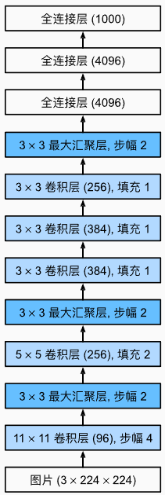

## 简介

**AlexNet**（2012）是首个在ImageNet大规模视觉识别挑战赛（ILSVRC）中显著超越传统方法的深度卷积神经网络，由Alex Krizhevsky团队提出。其成功标志着深度学习在计算机视觉领域的复兴。

**历史意义**：
- 将ImageNet Top-5错误率从26.2%降至15.3%（相对提升41%）。
- 证明GPU训练深度神经网络的可行性。
- 奠定现代CNN基础架构范式。

## 网络结构

### 核心架构
- **输入尺寸**：224×224×3（实际实现为227×227处理）
- **层级组成**：5个卷积层 + 3个全连接层
- **参数量**：约6000万

### 分层细节
| 层级      | 操作类型         | 核心参数                          | 输出维度      |
| ------- | ------------ | ----------------------------- | --------- |
| Input   | -            | -                             | 227×227×3 |
| Conv1   | 卷积+ReLU      | $96\times11\times11$，stride=4 | 55×55×96  |
| Pool1   | 最大池化         | 3×3窗口，stride=2                | 27×27×96  |
| Conv2   | 卷积+ReLU      | 256个5×5滤波器，padding=2          | 27×27×256 |
| Pool2   | 最大池化         | 3×3窗口，stride=2                | 13×13×256 |
| Conv3-5 | 连续3×3卷积+ReLU | 384/384/256通道，padding=1       | 13×13×256 |
| Pool3   | 最大池化         | 3×3窗口，stride=2                | 6×6×256   |
| FC6-8   | 全连接层         | 4096→4096→1000神经元             | 1000（输出）  |

## 关键创新点

### ReLU非线性激活
- **突破**：首次在大规模CNN中采用Rectified Linear Unit
- **优势**：
  - 解决梯度消失问题（相比Sigmoid/Tanh）。
  - 计算效率提升6倍（CIFAR-10实验）。

### 多GPU并行
- **实现方式**：模型并行（跨2个GTX 580 GPU）。
- **通信机制**：仅在特定层同步数据（Conv3/4/5）。

### 局部响应归一化（LRN）
- **公式**：$b_{x,y}^i = a_{x,y}^i / (k + α\sum_{j=max(0,i-n/2)}^{min(N-1,i+n/2)}(a_{x,y}^j)^2)^β$
- **作用**：模拟生物神经系统的侧抑制机制（后被BN替代）。

### Dropout正则化
- **应用位置**：全连接层（FC6/FC7）
- **丢弃概率**：0.5
- **效果**：减少模型对特定神经元的依赖

## 训练策略

### 数据增强

- **空间变换**
	- 随机裁剪（256→224）
	- 水平翻转

- **颜色扰动**
	- PCA主成分颜色偏移（对RGB通道添加高斯噪声）

- **训练配置**
	- **优化器**：动量SGD（momentum=0.9）
	- **学习率**：初始0.01，手动分阶段衰减
	- **批大小**：128
	- **权重衰减**：0.0005（L2正则化）

## 局限与改进

- **局限**
	1. **计算成本**：训练需5-6天（2×GTX 580）。
	2. **参数效率**：全连接层占参数量90%+。
	3. **特征复用**：未采用跳跃连接等特征复用机制。

- **改进**
	1. **全连接替代**：全局平均池化（如NiN）。
	2. **正则化演进**：LRN→Batch Normalization。
	3. **参数压缩**：模型蒸馏/量化技术。

## 总结

1. **里程碑意义**：首个证明深度学习潜力的实用化CNN

2. **设计遗产**：ReLU/Dropout/数据增强仍是现代DL标准组件

3. **研究启示**：展示硬件-算法协同创新的重要性

4. **历史地位**：2012-2015年间计算机视觉进步的起点