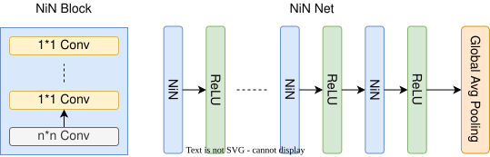

## 背景

- ​**传统CNN的局限性**：  
  早期卷积神经网络（CNN）依赖线性卷积核和池化层的堆叠，特征提取的非线性表达能力有限。  

- ​**NiN的提出**：  
  NiN（Network in Network）由**Min Lin等人在2013年**提出，核心思想是通过**微型多层感知机（MLP）​**增强局部非线性，并减少全连接层的参数量。  

- ​**关键动机**：  
  - 通过非线性组合提升卷积层的特征抽象能力。  
  - 用全局平均池化替代全连接层以降低过拟合风险。  

## 原理

### NiN块（MLP卷积层）

- ​**结构**：  
  每个NiN块由 ​**1个常规卷积层**​ 和 ​**多个1×1卷积层**​ 串联组成，每层后接非线性激活函数（如ReLU）。  
  - ​**1×1卷积的作用**：  
    - ​**跨通道特征融合**：调整通道维度并混合不同通道的信息。  
    - ​**增强非线性**：通过叠加激活函数增加模型的表达能力。  
    - ​**参数高效**：小尺寸卷积核大幅减少参数量。  

### 全局平均池化（GAP）

- ​**替代全连接层**：  
  传统CNN使用全连接层进行分类，而NiN在最后一层对每个特征图计算全局平均值，直接作为类别置信度。  
  - ​**优势**：  
    - 消除全连接层的大量参数，降低过拟合风险。  
    - 保留特征图的空间信息，增强模型鲁棒性。  

## 梯度计算与反向传播

### MLP卷积层的梯度

- ​**前向传播**：  
  输入 $X$ 经过多层1×1卷积和非线性激活后得到输出 $Y$，公式为：  
$$
  Y = \text{ReLU}(W_n * (\dots \text{ReLU}(W_2 * \text{ReLU}(W_1 * X + b_1)) + b_2) \dots ) + b_n)
  $$
  
- ​**反向传播**：  
	- 梯度通过链式法则逐层反向传播，计算每层权重 $W_i$ 和输入梯度。  
	- ​**局部梯度计算**：  
	  对第 $i$ 层的权重梯度：  
$$
    \frac{\partial L}{\partial W_i} = \frac{\partial L}{\partial Y_i} \cdot X_i^T
$$
	输入梯度传递至前一层：  
$$
    \frac{\partial L}{\partial X_i} = W_i^T \cdot \frac{\partial L}{\partial Y_i}
 $$

### 全局平均池化的梯度

- ​**梯度分配规则**：  
  假设特征图尺寸为 $H \times W$，第 $k$ 个通道的梯度 $\frac{\partial L}{\partial Y_k}$ 均匀分配到所有空间位置：  
$$
  \frac{\partial L}{\partial X_{i,j,k}} = \frac{1}{H \times W} \cdot \frac{\partial L}{\partial Y_k}
  $$
## 优点与缺点

### 优点

1. ​**参数效率高**：  
	- 1×1卷积压缩通道间冗余参数，全局平均池化减少全连接层的参数量。  

2. ​**非线性能力强**：  
	- 多层1×1卷积与激活函数叠加，提升复杂特征的建模能力。  

3. ​**抗过拟合**：  
	- 去除了全连接层，降低模型对训练数据噪声的敏感性。  

### 缺点

1. ​**计算开销增加**：  
	- 多层1×1卷积在深层网络中可能导致训练速度下降。  

2. ​**小数据集表现受限**：  
	- 高度非线性结构需要大量数据支撑，否则易欠拟合。  

3. ​**空间信息丢失**：  
	- 全局平均池化可能忽略局部细节，对细粒度分类任务不友好。 