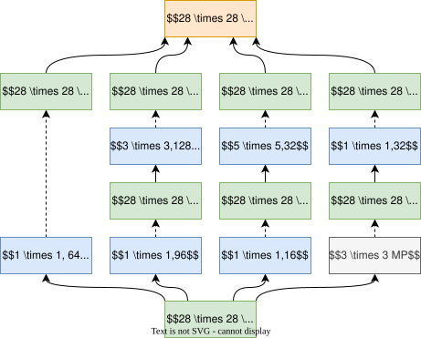

## 背景

GoogLeNet 是 Google 团队在 2014 年 ImageNet 竞赛（ILSVRC14）中提出的深度卷积神经网络模型，获得了图像分类任务冠军。其核心目标是在**保持高精度**的同时**显著降低计算量**，解决传统深度网络（如 AlexNet）因参数量过大导致的过拟合和计算资源消耗问题。

受 NiN（Network in Network）和**多尺度特征提取**思想启发，GoogLeNet 提出了创新的 **Inception 模块**，成为后续模型的基石。

## 设计思路

### 1. Inception 模块

- **核心思想**：在同一层级并行使用不同尺寸的卷积核（$1\times1$, $3\times3$, $5\times5$）和池化操作，融合多尺度特征。

- **原始问题**：直接堆叠不同卷积核会导致通道数爆炸，计算量过大（例如 $5\times5$ 卷积的计算成本高）。

- **解决方案**：引入 $1\times1$ 卷积进行**降维**（减少输入通道数），形成 **Bottleneck 结构**（图 1）。

### 2. 辅助分类器

- **作用**：缓解梯度消失问题，增强中间层的特征表达能力。
- **实现**：在网络中部插入两个辅助分类器，训练时对辅助损失加权（权重为 0.3），测试时移除。

### 3. 全局平均池化

- **替代传统全连接层**：直接对最后一层特征图进行全局平均池化，大幅减少参数量。

## 网络架构

### 整体结构

- **输入**：$224\times224\times3$ 的 RGB 图像。
- **主体结构**：9 个 Inception 模块堆叠，穿插 2 个辅助分类器和 4 个下采样层（最大池化）。
- **参数量**：约 500 万（AlexNet 为 6000 万），层数 22 层（含卷积层）。

### 详细层结构
| 阶段 | 类型                | 输出尺寸       | 说明                          |
|------|---------------------|----------------|-----------------------------|
| 1    | 卷积层              | $112\times112\times64$ | $7\times7$ 卷积，步长 2     |
| 2    | 最大池化            | $56\times56\times64$   | $3\times3$ 池化，步长 2     |
| 3    | 卷积层              | $56\times56\times192$  | $3\times3$ 卷积，步长 1     |
| 4    | Inception (3a)      | $28\times28\times256$  | 首个 Inception 模块，下采样  |
| 5-7  | Inception (3b-4e)   | $14\times14\times528$  | 堆叠 4 个 Inception 模块    |
| 8-9  | Inception (5a-5b)   | $7\times7\times832$    | 最后两个 Inception 模块     |
| 10   | 全局平均池化        | $1\times1\times1024$   | 替代全连接层                |
| 11   | 全连接层 + Softmax  | $1\times1\times1000$   | 输出分类概率                 |

## 技术细节

1. **$1\times1$ 卷积的作用**：
	 - 降维：减少输入通道数，控制计算量。
	 - 增加非线性：在降维后接 ReLU 激活函数。

2. **辅助分类器结构**：
	- 平均池化（$5\times5$，步长 3）→ $1\times1$ 卷积（128 通道）→ 全连接层（1024 维）→ Dropout → 分类层。

3. **训练技巧**：
	- 数据增强：随机裁剪、光照变换。
	- 优化器：RMSProp，动量 0.9。
	- 推理优化：测试时移除辅助分类器，使用多裁剪和 Softmax 平均提升精度。

## 总结

GoogLeNet 通过 Inception 模块实现了**多尺度特征融合**和**高效计算**，成为深度学习模型设计的重要里程碑。其参数量仅为 AlexNet 的 1/12，Top-5 错误率低至 **6.67%**，启发了后续的 Inception v2/v3/v4 和 Xception 等模型。