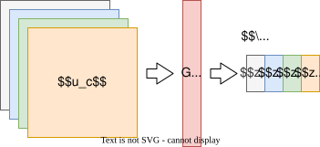
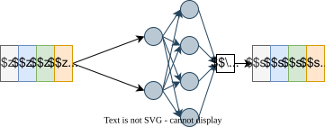
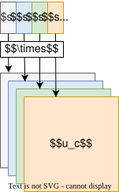

## 核心思想

SENet（Squeeze-and-Excitation Network）通过显式建模通道（channel）间的依赖关系，动态调整通道特征响应值，增强重要通道的权重，抑制不重要的通道。该方法在ImageNet 2017分类任务中取得冠军。

## SE模块详细设计

### 模块结构

SE模块包含两个核心操作：​**Squeeze** 和 ​**Excitation**，可插入到标准卷积模块中。

#### (1) Squeeze 操作

- ​**目的**：压缩空间信息，生成通道描述符。

- ​**方法**：全局平均池化（Global Average Pooling, GAP）：  $$z_c = \frac{1}{H \times W} \sum_{i=1}^{H} \sum_{j=1}^{W} u_c(i, j)$$其中 $u_c$ 是第 $c$ 个通道的特征图，$z_c \in \mathbb{R}^C$ 是压缩后的通道向量。

#### (2) Excitation 操作

- ​**目的**：学习通道权重，进行特征重标定。

- ​**方法**：两个全连接层（含降维与升维）和非线性激活：
$$s = \sigma(W_2 \delta(W_1 z))$$
  - $W_1 \in \mathbb{R}^{\frac{C}{r} \times C}$：降维全连接层（$r$ 为压缩比）
  - $\delta$：ReLU激活函数  
  - $W_2 \in \mathbb{R}^{C \times \frac{C}{r}}$：升维全连接层
  - $\sigma$：Sigmoid函数，输出权重 $s \in [0,1]^C$

#### (3) 特征重标定
将学习到的权重 $s$ 与原特征图逐通道相乘：
$$\tilde{u}_c = s_c \cdot u_c$$

## 网络结构

### SE模块的嵌入

SE模块可灵活插入到现有网络（如ResNet、Inception）中。以**SE-ResNet**为例：

#### SE-ResNet Bottleneck 结构

1. ​**标准Bottleneck**：
   - 1x1卷积（降维）
   - 3x3卷积（空间卷积）
   - 1x1卷积（升维）

2. ​**SE模块插入位置**：在最后一个1x1卷积之后，shortcut连接之前。

### 典型配置（以SE-ResNet-50为例）
| Stage | Layer           | Output Size | Repeat | SE模块位置        |
| ----- | --------------- | ----------- | ------ | ------------- |
| 1     | Conv1 + Pooling | 112x112     | 1      | -             |
| 2     | Conv2_x         | 56x56       | 3      | 每个Bottleneck末 |
| 3     | Conv3_x         | 28x28       | 4      | 每个Bottleneck末 |
| 4     | Conv4_x         | 14x14       | 6      | 每个Bottleneck末 |
| 5     | Conv5_x         | 7x7         | 3      | 每个Bottleneck末 |
| 6     | Global Pooling  | 1x1         | 1      | -             |

## 关键参数与设计细节

- **压缩比（Reduction Ratio, $r$）​**：

   - 控制SE模块中间层通道数的比例，典型值为 $r=16$。

   - 公式：中间层通道数 $C_{mid} = C / r$。

- ​**计算量分析**：

   - SE模块增加的参数量为：
$$\frac{2C^2}{r}$$
   例如，当 $C=1024, r=16$ 时，新增参数量为 $2 \times 1024^2 / 16 = 131,072$。

## 优点与局限性

### 优点

- ​**轻量级**：增加的参数量少（ResNet-50中仅增加~10%参数）。

- ​**通用性**：可嵌入到CNN、Transformer等架构中。

- ​**显著性能提升**：ImageNet上Top-5错误率相对下降~25%。

### 局限性

- ​**训练时间增加**：需额外计算通道权重。

- ​**对小模型提升有限**：通道数较少时效果减弱。

## 6. 后续改进方向
1. ​**空间与通道注意力结合**：如CBAM、SCSE
2. ​**动态调整压缩比**：根据网络深度自适应选择 $r$
3. ​**轻量化设计**：如MobileSeNet