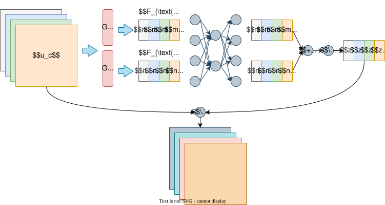
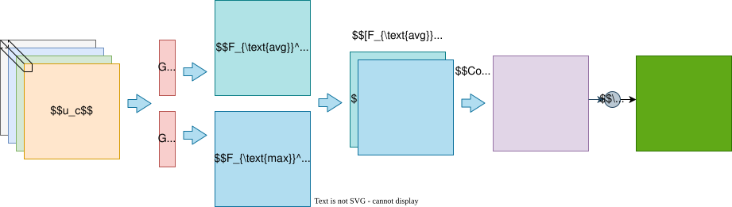
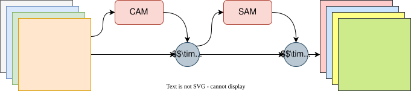

## 概述

CBAM卷积块注意力模块（Convolutional Block Attention Module）是一种轻量级的注意力机制模块，可集成到CNN中，通过**通道注意力**和**空间注意力**增强特征表达能力。其核心思想是自适应调整特征图的通道和空间权重。

## 详细设计

### 通道注意力模块（Channel Attention Module）

**输入**：特征图 $F \in \mathbb{R}^{H \times W \times C}$  。

**输出**：通道注意力权重 $M_c(F) \in \mathbb{R}^{1 \times 1 \times C}$。

#### 步骤：

1. ​**双路池化**：对 $F$ 分别进行全局平均池化和最大池化，得到两个特征向量：
   - $F_{\text{avg}}^c = \text{AvgPool}(F) \in \mathbb{R}^{1 \times 1 \times C}$
   - $F_{\text{max}}^c = \text{MaxPool}(F) \in \mathbb{R}^{1 \times 1 \times C}$

2. ​**共享MLP**：将池化结果输入共享的多层感知机（MLP），结构如下：
   - 第一个全连接层：维度 $C \rightarrow C/r$（$r$ 为缩减比例，通常设为16）
   - ReLU激活函数
   - 第二个全连接层：维度 $C/r \rightarrow C$

3. ​**融合与激活**：将两路结果相加并通过Sigmoid函数生成权重：
$$
   M_c(F) = \sigma\left( W_1(\delta(W_0 F_{\text{avg}}^c)) + W_1(\delta(W_0 F_{\text{max}}^c)) \right)
   $$
   其中 $W_0 \in \mathbb{R}^{C/r \times C}$ 和 $W_1 \in \mathbb{R}^{C \times C/r}$ 为MLP权重，$\delta$ 为ReLU，$\sigma$ 为Sigmoid。

### 空间注意力模块（Spatial Attention Module）

**输入**：经通道加权的特征图 $F' = M_c(F) \otimes F \in \mathbb{R}^{H \times W \times C}$  。

**输出**：空间注意力权重 $M_s(F') \in \mathbb{R}^{H \times W \times 1}$。

#### 步骤：

1. ​**通道池化**：对 $F'$ 沿通道维度进行平均池化和最大池化，得到两个特征图：
   - $F_{\text{avg}}^s = \text{AvgPool}(F') \in \mathbb{R}^{H \times W \times 1}$
   - $F_{\text{max}}^s = \text{MaxPool}(F') \in \mathbb{R}^{H \times W \times 1}$

2. ​**特征拼接与卷积**：将池化结果拼接后应用卷积：
   - 拼接：$[F_{\text{avg}}^s; F_{\text{max}}^s] \in \mathbb{R}^{H \times W \times 2}$
   - $7 \times 7$ 卷积：降维至单通道，输出 $\in \mathbb{R}^{H \times W \times 1}$

3. ​**激活**：通过Sigmoid生成空间权重：
$$
   M_s(F') = \sigma\left( f^{7 \times 7}([F_{\text{avg}}^s; F_{\text{max}}^s]) \right)
   $$
   其中 $f^{7 \times 7}$ 为卷积操作，$\sigma$ 为Sigmoid。

## 网络结构

CBAM模块可插入到CNN的任意卷积块之后。以ResNet为例，集成方式如下：

### 整体计算流程：

1. 特征图 $F$ 先通过通道注意力模块，得到加权特征 $F' = M_c(F) \otimes F$。

2. $F'$ 通过空间注意力模块，得到最终输出 $F'' = M_s(F') \otimes F'$。

## 优点和局限性

### 优点

1. ​**双注意力协同**：  
   - 通道注意力（Channel Attention）聚焦于"哪些通道更重要"，通过全局信息增强特征判别性。
   - 空间注意力（Spatial Attention）捕捉"特征图中关键区域"，提升定位能力。
   - 两者串联使用实现互补，实验表明比单独使用任一模块效果更好。

2. ​**轻量化设计**：  
   - 通道注意力使用MLP参数共享策略（两路池化共享同一MLP）。
   - 空间注意力仅需一个$7\times7$卷积。
   - 在ResNet-50中仅增加约0.1%参数量。

3. ​**即插即用特性**：  
   - 可嵌入任何CNN架构（VGG/ResNet/DenseNet等）。
   - 支持端到端训练，无需修改网络超参数。

### 局限性

1. ​**空间注意力设计争议**：  
   - 仅使用$7\times7$单层卷积可能难以捕捉复杂空间关系。
   - 对比Non-local Network等结构，长距离依赖建模能力较弱。

2. ​**通道注意力局限**：  
   - 通道压缩率$r$需手动设定（默认r=16可能非最优）。

3. ​**任务敏感性问题**：  
   - 在细粒度分类任务中，空间注意力可能过度聚焦局部区域。
   - 对纹理敏感的任务（如风格迁移）需调整注意力模块顺序。

4. ​**动态性不足**：  
   - 注意力权重生成方式固定（池化+MLP/卷积）。
   - 缺乏动态适应性（如动态卷积/可变形卷积的灵活性）。

## 小结

- ​**轻量高效**：引入少量参数即可显著提升模型性能。

- ​**双注意力机制**：通道注意力聚焦“what”，空间注意力聚焦“where”。

- ​**即插即用**：可嵌入到VGG、ResNet等主流架构中。