## 结构
### 卷积层

- **滑动窗口操作**：核在输入特征图上按步长$s$滑动，通过点积生成特征响应  
  **公式**：$$y_{ij}^{(l)} = \sigma\left( \sum_{k=1}^K w_{lk}^{(l)} x_{i(j+k-1)}^{(l-1)} + b_l^{(l)} \right)$$  
  *参数说明*：  
  - $(H,W,C)$：输入特征图尺寸（高×宽×通道数）  
  - $(K,s)$：卷积核尺寸（边长）和步长  
  - $b_l^{(l)}$：层偏置项  

- **填充（Padding）**：  
  - **有效填充（Valid）**：无填充，输出尺寸 $O = (H-s+1)(W-s+1)$  
  - **同尺寸填充（Same）**：上下左右各填充$(s-1)/2$层，保证输出尺寸与输入相同  

+ **权重共享**：卷积核在输入数据上滑动复用参数。这样大幅降低网络参数量（如$3\times3$卷积核仅需9个参数扫描全图），同时使模型具备平移不变性（相同特征可在任意位置被识别）。这种机制既提升计算效率，又增强模型泛化能力。

### 池化层

### 最大池化和平均池化

- **最大池化**：在窗口内保留最大值  
$$a_{ij} = \max_{p=-f}^{f} \quad x_{[i+p][j+q]}$$
  *参数*：窗口大小$f \times f$，步长通常取$f$

- **平均池化**：窗口内元素均值  
$$a_{ij} = \frac{1}{f^2} \sum_{p=-f}^{f} \sum_{q=-f}^{f} x_{i+p}[j+q]$$
### 池化层作用

#### 1. 降维与计算优化  

- **特征图压缩**：通过下采样将输入尺寸缩减为$O = \frac{H}{2} \times \frac{W}{2}$（当池化窗口$f=2$时）。
- **参数锐减**：后续全连接层参数量减少$75\%$（例如输入尺寸从$224\times224$压缩到$112\times112$）。

#### 2. 平移不变性增强  

- **位置鲁棒性**：对微小位移不敏感，例如识别"猫"时无论其出现在图像左/右侧均能激活相同特征。
- **数学表达**：$y = \max(x_{i:i+f,j:j+f})$ 消除局部位置信息。

#### 3. 过拟合抑制  

- **特征选择**：最大池化保留显著特征（如边缘、角点），过滤噪声  。
- **信息瓶颈**：强制网络学习压缩后的关键特征表示。

#### 4. 感受野扩展  

- **层级覆盖**：通过多级池化逐步扩大感知范围（例如3层池化后单像素覆盖原图$8\times8$区域）。
- **跨区域关联**：高层特征可捕获全局上下文信息。

#### 5. 计算稳定性提升  

- **梯度平滑**：平均池化可缓解梯度突变（对比公式$\frac{\partial L}{\partial x} = \frac{1}{f^2}\sum \frac{\partial L}{\partial y}$）。  
- **数值范围控制**：输出值域保持稳定（最大池化值$\in [0,255]$，平均池化值$\in [0,255]$）。

#### 6. 多尺度特征融合  

- **空间金字塔**：通过不同池化尺寸（如$2\times2$和$3\times3$）并行提取多粒度特征。
- **空洞池化**：间隔采样构建稀疏特征表达（常用于语义分割任务）。

### 全连接层

- 输入特征图展平为向量后进行矩阵乘法：  
$$z = W^T \cdot \text{Flatten}(P) + b$$
  *参数*：$W \in \mathbb{R}^{D \times K}$（$D$为分类类别数）

## 梯度计算与反向传播

### 反向传播框架

**损失函数**：假设使用交叉熵损失  
$$L = -\frac{1}{N} \sum_{n=1}^N \sum_{d=1}^D y_n^d \log(p_n^d)$$
**目标**：计算$\frac{\partial L}{\partial \theta}$（$\theta$包含所有权重和偏置）

### 池化层反向传播

- **最大池化梯度传播：** 
  仅当某元素是窗口最大值时，梯度保留该位置的局部导数  
$$\frac{\partial L}{\partial x_{i,j}} = \begin{cases} 
  \frac{\partial L}{\partial a_{i',j'}} & \text{若 } (i,j) \text{ 是 } a_{i',j'} \text{ 的最大值位置} \\
  0 & \text{否则}
  \end{cases}$$

+ **平均池化梯度传播**：  
  设池化窗口尺寸为$f \times f$，输入梯度为$\frac{\partial L}{\partial y}$，则输出梯度为：
$$
\frac{\partial L}{\partial x_{ij}} = \frac{1}{f^2} \sum_{m=0}^{f-1} \sum_{n=0}^{f-1} \frac{\partial L}{\partial y_{\lfloor i/f \rfloor, \lfloor j/f \rfloor}}
$$
  每个输入位置的梯度是其对应池化窗口输出梯度的均值分配。当stride=f时简化为：
$$
\frac{\partial L}{\partial x} = \frac{1}{f^2} \cdot \text{repeat}(\frac{\partial L}{\partial y})
$$

### 卷积层反向传播（详细步骤）

1. **计算输入梯度**：  
$$\delta^{(l-1)} = \text{ConvolveTransposed}(\delta^{(l)}, W^{(l)})$$
   *其中*：$\text{ConvolveTransposed}$表示转置卷积（即核的反向滑动）

2. **参数梯度计算**：  
   - 权重梯度：  
$$\frac{\partial L}{\partial w_{lk}^{(l)}} = \sum_{i,j} \delta^{(l-1)}_{i,j} \cdot x^{(l-1)}_{i(j+k-1)}$$
   - 偏置梯度：  
$$\frac{\partial L}{\partial b_{l}^{(l)}} = \sum_{i,j} \delta^{(l-1)}_{i,j}$$
### 计算复杂度

| 层类型      | 时间复杂度            | 空间复杂度             |
| -------- | ---------------- | ----------------- |
| **卷积层**  | $O(HWKC^2)$      | $O(KC)$（核参数）      |
| **池化层**  | $O(HWK)$         | $O(HWK/P)$（输出特征图） |
| **全连接层** | $O(HWK \cdot D)$ | $O(D)$（输出神经元）     |

**总时间复杂度**：  
$$O(HWK^2C + HWKD + N)$$

*优化手段*：  
1. **快速傅里叶变换（FFT）卷积**：将时间复杂度降至$O(HWK \log HWK)$  
2. **深度可分离卷积**：分解为深度卷积和逐点卷积，减少计算量3-4倍  

## 优点与缺点

### 优点

1. **特征学习自动化**：  
   - 通过多层非线性变换自动提取低级→高级特征（如边缘→纹理→物体部件）。

2. **参数效率提高**：  
   - 相比全连接网络，参数量从$HW^2$降至$HK$（$H,W$为输入尺寸，$K$为核数）。

3. **平移不变性保证**：  
   - 通过权重共享机制，模型对图像平移具有鲁棒性。

4. **局部连接性质**：  
   - 符合生物视觉系统（V1区神经元感受野特性）。

### 缺点

5. **位置敏感性缺陷**：  
   - 完全丢失绝对位置信息，难以处理需要精确位置的任务（如图像分割）。

6. **计算瓶颈**：  
   - 大规模CNN（如GPT视觉模型）需数千张GPU卡并行计算。

7. **过拟合风险**：  
   - 卷积核数量过多可能导致特征冗余（需配合Dropout、BN等正则化）。

8. **梯度消失问题**：  
   - 深层网络中梯度随网络加深指数级衰减（可通过残差连接缓解）。

## 应用场景

9. **计算机视觉**：目标检测（YOLO）、图像超分辨率（SRCNN）  

10. **自然语言处理**：文本分类（CNN-Text）、语义分割（U-Net）  

11. **医学影像**：肺结节检测（3D CNN）、病理切片分析  

12. **时序数据**：语音识别（CNN-TDNN）、股票预测（Temporal CNN）