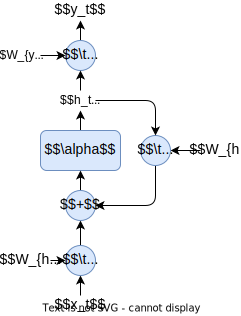
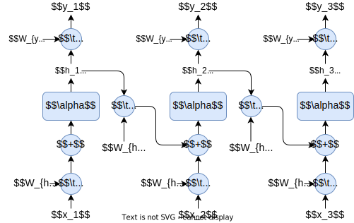

# 深度学习中的RNN笔记

## 原理

循环神经网络（Recurrent Neural Network, RNN）是一种用于处理序列数据的神经网络。它与传统的前馈神经网络的主要区别在于，RNN考虑了时间维度上的依赖性，即当前输出不仅取决于当前输入，还取决于之前时刻的输入。RNN通过在网络中引入循环结构来实现这一点，每个神经元都会接收上一时刻自身的输出作为当前时刻的一部分输入。

数学表达式如下：
- $h_t = \sigma(W_{hx}x_t + W_{hh}h_{t-1} + b_h)$
- $y_t = \sigma(W_{yh}h_t + b_y)$

其中，$h_t$是隐藏状态，$x_t$是输入，$y_t$是输出，$W_{hx}$, $W_{hh}$, $W_{yh}$分别是输入到隐藏、隐藏到隐藏和隐藏到输出的权重矩阵，$b_h$, $b_y$是偏置项，$\sigma$是激活函数。

循环神经网络的展开

## 损失函数

在训练过程中，通常使用交叉熵损失函数来衡量模型预测值与真实标签之间的差异。对于一个序列长度为T的时间序列问题，总的损失函数L可以表示为所有时间点损失的总和：

$L = -\sum_{t=1}^{T} \sum_{i} y_i^t \log(\hat{y}_i^t)$

其中，$y_i^t$ 是第$t$时刻的真实标签， $\hat{y}_i^t$ 是模型的预测值。

## 梯度更新

RNN使用反向传播算法的一种变体——随时间反向传播（Backpropagation Through Time, BPTT）来更新权重。BPTT将网络展开在时间维度上，然后应用标准的反向传播算法计算梯度，并使用优化算法如SGD或Adam更新参数。

## 优缺点

### 优点

- 能够处理任意长度的序列数据。

- 具有记忆功能，可以捕捉时间序列中的动态信息。

- 对于许多自然语言处理任务表现良好，如语言建模、机器翻译等。

### 缺点

- 随着序列长度增加，容易出现梯度消失或爆炸的问题，这限制了其处理长距离依赖的能力。

**梯度消失的原因**

链式法则的影响：在BPTT过程中，为了计算损失函数关于权重的梯度，需要通过链式法则将误差逐层向前传递。当激活函数（如sigmoid或tanh）的导数较小时，这些小值会在多层网络中相乘，导致梯度越来越小，最终趋向于零。

长期依赖问题：对于存在长时间间隔相关性的任务，RNN需要学习长时间步上的依赖关系。然而，由于上述原因，随着间隔的增加，梯度会逐渐减小，使得网络难以调整早期层的权重以捕捉这种依赖性，从而导致模型无法有效地学习长期依赖关系。

**梯度爆炸的原因**

累积效应：相反地，如果激活函数的导数过大，或者权重矩阵的范数很大，那么在进行梯度计算时，这些值会在多个时间步骤上累积，导致梯度迅速增大，即所谓的梯度爆炸现象。这种情况会使参数更新变得非常剧烈，可能导致模型不稳定，甚至训练失败。

- 计算效率较低，特别是在处理非常长的序列时。

- 相较于一些改进版本如LSTM和GRU，基本RNN在复杂任务上的性能较差。