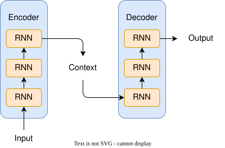
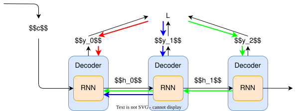
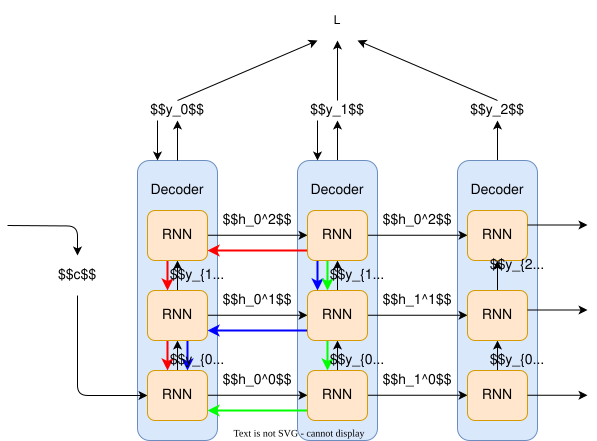

## 一、基本概念

编码器-解码器（Encoder-Decoder）框架是深度学习中用于处理序列数据的一种经典架构，最初在机器翻译任务中得到广泛应用。该框架由两部分组成：编码器和解码器。编码器负责将输入序列转换为一个固定长度的向量Context，而解码器则根据这个向量生成目标序列。

## 二、工作原理

### 1. 编码阶段

输入序列通过一系列的变换，逐渐将其转化为隐藏状态表示。
+ RNN/LSTM/GRU：逐步处理序列，最后隐藏状态作为上下文
+ CNN：通过卷积层提取特征
+ Transformer：使用自注意力机制（基础版本）

这些隐藏状态通常被组合成一个上下文向量$C$，用于概括整个输入序列的信息。数学表达式可以表示为：
$$h_t,y_t = f_{enc}(x_t, h_{t-1})$$
$$c = h_T$$
其中$X$代表输入序列，$f$代表编码过程中的变换函数，$T$为最后一个时间步。

### 2. 解码阶段

- 利用编码阶段生成的上下文向量$C$作为初始状态，或者与解码器的状态进行结合，开始生成输出序列。
- 解码器逐个元素地生成目标序列，直到生成特定的结束标记。
- 数学上，对于时间步$t$的输出可以表示为：
$$s_0,y_0 = f_{dec}(c, [sos])$$
$$s_t,y_t = f_{dec}(s_{t-1}, y_{t-1})$$
$$P(y_t|y_{<t}, x) = g(s_t)$$
其中$y_{<t}$表示到目前为止已生成的序列，$g$是解码过程中的变换函数。

## 三、梯度反向传播

### 1. 损失函数计算
首先计算解码器输出层的交叉熵损失：
$$L = -\sum y_t \log P(y_t|y_{<t}, c)$$
其中$P_t$为第$t$个时间步的softmax输出。然后将$\frac{\partial L}{\partial P_t}$作为初始的梯度，从损失函数开始反向传播。
### 2. 解码器内部传播

- **输出层 → 隐藏层**：
$$\frac{\partial L}{\partial s_t} = \frac{\partial L}{\partial P_t} \cdot \frac{\partial P_t}{\partial s_t}$$
其中$P_t$为第$t$个时间步的softmax输出，$s_t$为第$t$个时间步的隐状态。

- **隐藏层间传递**（以LSTM为例）：
$$\frac{\partial L}{\partial s_{t-1}} = \frac{\partial L}{\partial s_t} \cdot \frac{\partial s_t}{\partial s_{t-1}}$$
### 3. 关键连接点：上下文向量(c)

- **梯度注入**：

通过BPTT将每个时间步的损失累加到$c$上，计算图按时间展开如下：

对于单层的解码器，$L$对$c$的梯度是时间尺寸上的累积：
$$\frac{\partial L}{\partial c} = \sum_{t=1}^{T'} \frac{\partial L}{\partial s_t} \cdot \frac{\partial s_t}{\partial s_{t-1}} \cdot \cdot \cdot \frac{\partial s_0}{\partial c}$$

对于多层的解码器，$L$对$c$的梯度既是时间尺寸上的累积和层上的累积：
$$
\frac{\partial L}{\partial h_t^{(l)}} = \underbrace{\frac{\partial L}{\partial h_{t+1}^{(l)}} \cdot \frac{\partial h_{t+1}^{(l)}}{\partial h_t^{(l)}}}_{\text{时间步传播}} + \underbrace{\frac{\partial L}{\partial h_t^{(l+1)}} \cdot \frac{\partial h_t^{(l+1)}}{\partial h_t^{(l)}}}_{\text{层间传播}}$$

- **数学形式**：
  对于每个解码步 $t$，有：
$$\frac{\partial s_t}{\partial c} = \frac{\partial f_{dec}(s_{t-1}, y_{t-1}, c)}{\partial c}$$

### 4. 编码器梯度计算

编码器的梯度传播同样是根据BPTT将$\frac{\partial L}{\partial c}$沿着时间步展开的计算图进行传播。

- **上下文向量 → 编码器输出**：
$$\frac{\partial L}{\partial h_T} = \frac{\partial c}{\partial h_T} \cdot \frac{\partial L}{\partial c}$$
- **编码器时序传播**（以RNN为例）：
$$\frac{\partial L}{\partial h_{t-1}} = \frac{\partial h_t}{\partial h_{t-1}} \cdot \frac{\partial L}{\partial h_t}$$

### 四、梯度流动特性分析

### 1. 路径长度对比
| 组件       | 典型路径长度                     |
|------------|----------------------------------|
| 解码器内部 | T'步（输出序列长度）             |
| 编码器内部 | T步（输入序列长度）              |
| 总路径     | T + T' 时间步                    |

### 2. 梯度衰减问题

- **长程依赖挑战**：当T+T'较大时（如>20步），传统RNN会出现梯度消失
- **缓解方案**：
  - 使用LSTM/GRU的门控机制
  - 引入残差连接（Residual Connections）
  - 采用Transformer的自注意力结构

### 3. 梯度分量统计
| 梯度来源       | 占比范围   | 主要影响参数                |
|----------------|------------|-----------------------------|
| 解码器输出层   | 60%-80%    | 解码器输出投影矩阵          |
| 上下文向量(c)  | 15%-30%    | 编码器最后隐藏层参数        |
| 编码器早期层    | <5%        | 编码器底层特征提取器        |

### 五、不同架构的梯度特性

### 1. RNN系模型（LSTM/GRU）

- **梯度流动特点**：
  - 沿时间步展开计算图
  - 梯度通过隐藏状态链式传播
  - 上下文向量c通常取$h_T$

- **梯度计算式**：
$$\frac{\partial c}{\partial h_T} = I$$ （单位矩阵）

### 2. Transformer架构

- **关键差异点**：
  - 上下文向量c变为编码器输出矩阵H ∈ ℝ^{T×d}
  - 解码器通过交叉注意力访问全部编码器输出

- **梯度传播新特性**：
  $\frac{\partial L}{\partial H} = \sum_{t=1}^{T'} \frac{\partial L}{\partial A_t} \cdot \frac{\partial A_t}{\partial H}$
  （其中A_t为注意力权重）

### 3. CNN编码器+RNN解码器

- **特殊处理**：
  - 图像CNN的梯度通过空间位置传播
  - 特征图→上下文向量的池化操作影响梯度分布
  - 典型梯度式：$\frac{\partial c}{\partial F_{i,j}} = \frac{1}{HW}$ （平均池化时）

### 六、梯度优化实践

### 1. 监控指标
- **编码器梯度范数**：$\|g_{enc}\|_2$ 应保持在1e-3～1e-1范围
- **解码器/编码器梯度比**：理想值在3:1～10:1之间

### 2. 实用技巧
- **梯度裁剪**：设置阈值（如1.0）防止梯度爆炸
- **渐进式训练**：先固定编码器训练解码器，再联合微调
- **参数初始化**：编码器最后层使用较大初始化方差（如He初始化）

> **关键结论**：编码器-解码器结构的梯度流动形成了深度计算图，上下文向量c是梯度传递的关键枢纽。合理控制梯度流动效率是模型成功训练的核心要素。

## 七、训练

### 1. 数据流动与参数更新

- **前向传播路径**：输入序列 $X=(x_1,...,x_T)$ 通过编码器网络生成上下文向量 $c = f_{enc}(X)$，该向量作为解码器的初始状态输入
- **损失计算**：使用交叉熵损失函数 $L = -\sum_{t=1}^T y_t^{true} \log P(y_t|y_{<t}, c)$，衡量预测分布与真实标签的差异
- **反向传播**：梯度同时流向编码器和解码器，更新两者的参数 $\theta_{enc}$ 和 $\theta_{dec}$

### 2. 关键技术机制

- **Teacher Forcing**：
  - 训练时每个时间步强制输入真实标签 $y_{t-1}^{true}$。
  - 优点：加速收敛，缓解误差累积。
  - 缺点：可能导致推理时的曝光偏差（Exposure Bias）。

- **序列掩码**：
  - 对变长序列进行填充（Padding）后，通过掩码机制忽略无效位置的损失计算。
  - 保证批量训练时的高效并行计算。

### 3. 典型训练配置

- **优化器选择**：Adam（学习率 $3\times10^{-4}$～$10^{-3}$）或 SGD with momentum
- **正则化手段**：
	- Dropout（概率 0.1～0.3）
	- 权重衰减（L2 正则化）
	- 梯度裁剪（阈值 1.0～5.0）
- **批次处理**：动态批次（Dynamic Batching）处理不同长度序列

## 八、推理阶段

### 1. 生成过程特性

- **自回归生成**：解码器逐步生成输出序列 $Y=(y_1,...,y_{T'})$，满足 $y_t = \arg\max P(y|s_{t-1}, y_{t-1}, c)$
- **终止条件**：
	- 生成特殊结束符 \<end\>
	- 达到预设最大长度（如 100 tokens）
- **确定性 vs 随机性**：
  - 确定性方法（如贪心搜索）易陷入局部最优
  - 随机性方法（如温度采样）增强生成多样性

### 2. 常用生成策略对比

| 策略   | 核心原理              | 优点       | 缺点         |
| ---- | ----------------- | -------- | ---------- |
| 贪心搜索 | 每步选择概率最高的token    | 计算效率高    | 易丢失全局最优解   |
| 束搜索  | 维护k个候选序列（束宽=3～10） | 平衡质量与效率  | 内存消耗随k线性增长 |
| 顶层采样 | 仅从概率前p%的候选集中采样    | 兼顾质量与多样性 | 需要调整p值     |
| 温度缩放 | 通过温度参数τ控制分布平滑度    | 灵活调节随机性  | 需经验性调整τ值   |

### 3. 推理优化技术

- **缓存机制**：对编码器输出进行缓存，避免重复计算
- **长度惩罚**：在束搜索中引入长度归一化项，防止生成过短序列
- **早停机制**：当多个候选序列生成结束符时提前终止计算

## 九、训练与推理差异分析

### 1. 计算图差异

- **训练阶段**：构建完整的前向计算图，包含所有时间步的并行计算
- **推理阶段**：采用动态计算图，每个时间步依赖前一步的输出

### 2. 内存消耗特征

- **训练内存峰值**：主要消耗在存储中间激活值用于反向传播
- **推理内存需求**：重点关注模型参数和缓存状态的存储

### 3. 典型性能指标

| 阶段  | 关键指标          | 典型值范围             |
| --- | ------------- | ----------------- |
| 训练  | 单步迭代时间        | 100～500 ms/batch  |
|     | GPU显存占用       | 8～32 GB           |
| 推理  | 单序列延迟         | 50～500 ms/query   |
|     | 吞吐量（V100 GPU） | 100～1000 tokens/s |

> **注意**：实际性能受模型规模（如LSTM单元数/Transformer层数）、硬件配置（GPU型号）及实现优化水平的影响显著
## 十、改进机制

为了克服基本编码器-解码器模型的一些局限性，如难以捕捉长距离依赖关系等问题，研究者提出了注意力机制（Attention Mechanism）。注意力机制允许解码器在每一步生成输出时，动态地关注输入序列的不同部分，从而提高模型性能。