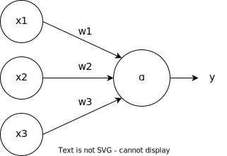

# 深度学习中的感知机（Perceptron）

## 1. 引言

**感知机（Perceptron）** 是一种线性分类模型，是神经网络的基础。感知机的工作原理可以追溯到 1950 年代末期，它是人工神经网络中最早的模型之一。感知机模型被广泛应用于二分类任务，尤其是在早期的模式识别中。感知机的核心思想是将输入信号加权求和，并通过激活函数进行非线性变换。

感知机可以分为两类：**单层感知机**和**多层感知机**。

## 2. 单层感知机（Single-Layer Perceptron）

单层感知机是最基础的感知机模型，由输入层和输出层组成。它用于二分类问题，通过学习一个超平面将数据分为两类。

### 2.1 单层感知机的原理

假设输入向量为 $\mathbf{x} = (x_1, x_2, \dots, x_n)$，感知机的输出为 $y \in \{0, 1\}$，模型的目标是根据输入向量 $\mathbf{x}$ 来预测 $y$。

#### 2.1.1 线性组合

感知机通过对输入进行加权求和来进行预测。给定一个权重向量 $\mathbf{w} = (w_1, w_2, \dots, w_n)$ 和偏置项 $b$，感知机的计算过程为：

$$
z = \mathbf{w}^T \mathbf{x} + b = w_1 x_1 + w_2 x_2 + \dots + w_n x_n + b
$$

#### 2.1.2 激活函数

接下来，感知机通过激活函数将线性组合的结果转换为输出。单层感知机常用的激活函数是**阶跃函数**（step function）：

$$
y = 
\begin{cases} 
1, & \text{if } z \geq 0 \\
0, & \text{if } z < 0
\end{cases}
$$

这里，$y$ 是感知机的预测输出，若 $z \geq 0$，则输出为 1，否则输出为 0。

#### 2.1.3 学习过程（权重更新）

感知机的目标是通过训练样本来调整权重和偏置，直到模型能够正确地分类数据。单层感知机通常使用**感知机学习规则**来更新权重：

$$
w_i = w_i + \Delta w_i = w_i + \eta (y^{(t)} - \hat{y}) x_i
$$

$$
b = b + \eta (y^{(t)} - \hat{y})
$$

其中：
- $\eta$ 是学习率，控制每次更新的步长；
- $y^{(t)}$ 是样本的真实标签；
- $\hat{y}$ 是模型的预测标签；
- $x_i$ 是输入特征。

### 2.2 单层感知机的优缺点

#### 优点

- **简单直观**：结构简单，易于理解和实现。

- **计算高效**：适用于小规模数据集，计算开销较低。

#### 缺点

- **线性不可分问题**：单层感知机只能处理线性可分的任务，对于非线性可分问题无法进行有效分类。

## 3. 多层感知机（Multi-Layer Perceptron, MLP）

多层感知机是感知机的扩展，属于深度神经网络的一种。与单层感知机不同，MLP 有多个层次：一个输入层、一个或多个隐藏层和一个输出层。

### 3.1 多层感知机的原理

多层感知机通过引入一个或多个隐藏层来提高模型的表达能力。每个隐藏层的节点都与前一层的节点连接，并且每个节点都有自己的权重和偏置。MLP 使用非线性激活函数来处理输入和输出。

#### 3.1.1 计算过程

假设输入层的输入是 $\mathbf{x} = (x_1, x_2, \dots, x_n)$，每个隐藏层的输出通过加权和计算并应用激活函数。对于第 $l$ 层的节点，计算过程为：

$$
z^{(l)} = \mathbf{w}^{(l)} \cdot \mathbf{a}^{(l-1)} + b^{(l)}
$$

$$
a^{(l)} = \sigma(z^{(l)})
$$

其中：
- $\mathbf{w}^{(l)}$ 是第 $ l $ 层的权重向量；
- $b^{(l)}$ 是第 $l$ 层的偏置；
- $\sigma(z^{(l)})$ 是激活函数（例如 ReLU、Sigmoid、Tanh 等）。

#### 3.1.2 激活函数

常见的激活函数包括：
- **Sigmoid**：输出范围为 [0, 1]，常用于二分类任务。
$$\sigma(z) = \frac{1}{1 + e^{-z}}$$
- **ReLU（Rectified Linear Unit）**：输出非负值，广泛用于隐藏层。
$$\text{ReLU}(z) = \max(0, z)$$
- **Tanh**：输出范围为 [-1, 1]，常用于隐藏层。
$$\text{Tanh}(z) = \frac{e^z - e^{-z}}{e^z + e^{-z}}$$
#### 3.1.3 损失函数

多层感知机通常使用交叉熵损失（对于分类问题）或均方误差（对于回归问题）作为损失函数。

#### 3.1.4 反向传播

多层感知机通过**反向传播算法**（Backpropagation）来训练网络。反向传播通过链式法则计算每层的梯度，并根据梯度更新权重。反向传播的步骤包括：
1. 计算输出层的误差。
2. 将误差传播回隐藏层，计算每层的梯度。
3. 更新权重和偏置。

### 3.2 多层感知机的优缺点

#### 优点

- **高表达能力**：由于引入了多个隐藏层，MLP 可以拟合复杂的非线性函数，适用于更复杂的任务。

- **通用性**：可以应用于分类、回归等多种任务。

#### 缺点

- **训练难度**：MLP 的训练过程较为复杂，需要使用反向传播和梯度下降算法，可能遇到梯度消失、梯度爆炸等问题。

- **计算开销大**：多个隐藏层使得模型计算量大，训练时间较长。

## 4. 总结

- **单层感知机** 适用于线性可分的任务，结构简单且高效，但无法解决非线性问题。

- **多层感知机** 通过引入多个隐藏层，能够处理非线性可分问题，具有更强的表达能力，但训练和计算开销较大，且容易遇到梯度问题。