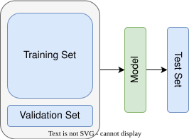

## 1. 定义

Holdout Validation 是一种简单的模型验证方法，通过将数据集划分为互斥的**训练集**、**验证集**（可选）和**测试集**，用于评估模型的泛化能力。其核心思想是“隔离”部分数据，模拟模型在未见数据上的表现。

## 2. 步骤
### 数据划分

- **训练集（Training Set）**：用于模型训练（如调整权重）。

- **验证集（Validation Set）**：可选，用于超参数调优或早停。

- **测试集（Test Set）**：仅用于最终评估模型性能，避免数据泄露（给模型）。

- 常见比例：  
  - 无验证集：`训练集:测试集 = 70%:30%` 或 `80%:20%`  
  - 含验证集：`训练集:验证集:测试集 = 60%:20%:20%`

### 流程

1. 在训练集上训练模型。

2. 在验证集上调整超参数（如学习率、正则化强度）。 

3. 在测试集上评估最终性能（仅一次）。

## 3. 优缺点

### 优点

- **简单高效**：仅需一次划分，计算成本低。

- **适用大数据**：当数据量充足时，划分后各子集仍具代表性。

- **避免过拟合**：测试集完全独立，反映模型真实泛化能力。

### 缺点

- **数据利用率低**：尤其在小数据集中，训练集可能不足。

- **随机性偏差**：划分方式可能影响结果（如类别分布不均）。  

- **单次评估风险**：结果可能因划分不同波动较大（对比交叉验证）。

## 4. 应用场景

- 数据量较大时快速验证模型。

- 初步实验阶段，作为基准方法。

- 与交叉验证结合（如先 Holdout 划分，再在训练集内做 K-Fold）。

## 5. 注意事项

- **分层抽样（Stratified Sampling）**  
  分类问题中保持各类别在训练集和测试集中的比例一致。

- **避免数据泄露**  
  预处理（如归一化、缺失值填充）应在划分后**分别进行**，或基于训练集统计处理测试集。

- **多次实验取平均**  
  通过多次随机划分并评估，减少单次划分的随机性影响。

## 6. 总结

Holdout Validation 是模型验证的基线方法，适合数据量充足或资源受限的场景，但需注意划分的随机性和数据代表性。在小数据集或需稳定评估时，建议结合交叉验证使用。