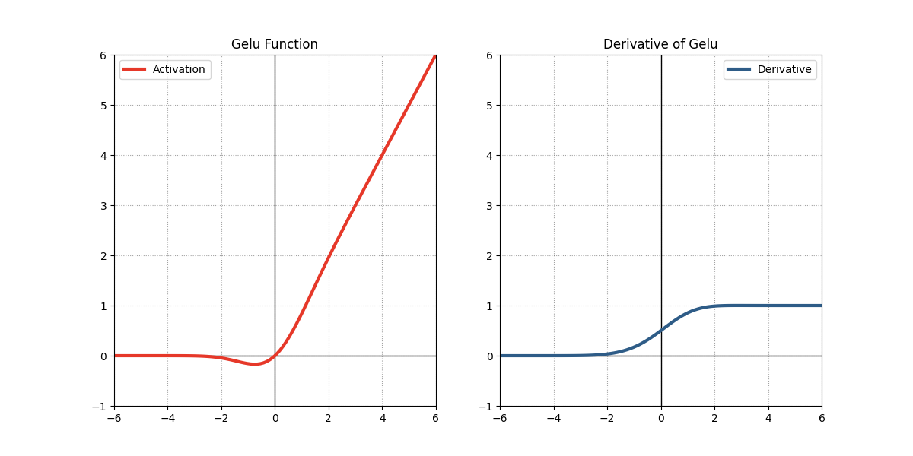

## 背景

GELU（Gaussian Error Linear Unit）是一种针对深度学习模型设计的激活函数，首次在2016年的论文[《Gaussian Error Linear Units (GELUs)》](https://arxiv.org/abs/1606.08415)中提出。它的设计动机是结合**随机正则化**的思想（如Dropout），通过输入值的概率分布动态调整激活强度。GELU在Transformer系列模型（如BERT、GPT）中被广泛使用，逐渐取代了ReLU和ELU等传统激活函数。

## 原理

GELU的数学定义基于输入$x$与标准正态分布$\mathcal{N}(0,1)$的累积分布函数$\Phi(x)$的乘积：
$$
\text{GELU}(x) = x \cdot \Phi(x) = x \cdot \frac{1}{2} \left[ 1 + \text{erf}\left( \frac{x}{\sqrt{2}} \right) \right]
$$
其中：
- $\Phi(x)$：标准正态分布的累积分布函数
- $\text{erf}(x)$：误差函数（Error Function），定义为 $\text{erf}(x) = \frac{2}{\sqrt{\pi}} \int_0^x e^{-t^2} dt$

## 近似公式

由于$\text{erf}(x)$的计算成本较高，研究者提出了以下近似形式：

1. ​**Tanh近似**​（计算速度快，精度略低）：
$$
\text{GELU}(x) \approx 0.5x \left( 1 + \tanh\left( \sqrt{\frac{2}{\pi}} \left( x + 0.044715x^3 \right) \right) \right)
$$
2. ​**Sigmoid近似**​（平衡精度与速度）：
$$
\text{GELU}(x) \approx x \cdot \sigma(1.702x)
$$
其中$\sigma(x)$是Sigmoid函数。

## 优点和缺点

### 优点

- **平滑性**
	- 相比ReLU在$x=0$处的不可导性，GELU处处可导，其输出通过高斯分布的累积分布函数平滑过渡，梯度更稳定，尤其适合深层网络训练。
- **自适应非线性**  
	- 结合了输入的概率分布特性（通过乘以输入的累积概率），GELU能够根据输入动态调整激活强度，平衡线性和非线性行为，增强模型表达能力。
- **减少了死亡ReLU问题**
	- 由于GELU对负值也有响应（虽然较小），因此它减少了死亡RELU的发生。
- **实践表现优异**  
	- 在自然语言处理（NLP）和计算机视觉（CV）任务中，GELU常优于ReLU、ELU等激活函数，尤其在预训练大模型中（如BERT、GPT）显著提升模型性能。
### 缺点

- **计算成本高**
	- 精确计算$\text{erf}(x)$需要较高算力，尽管近似式缓解了这一问题。
- **近似误差**
	- 近似公式会引入微小误差，可能影响模型收敛稳定性。
- **理论解释不足**  
	- GELU的设计依赖启发式方法，缺乏严格的数学理论支撑，其成功原因更多归因于实践效果而非理论推导。