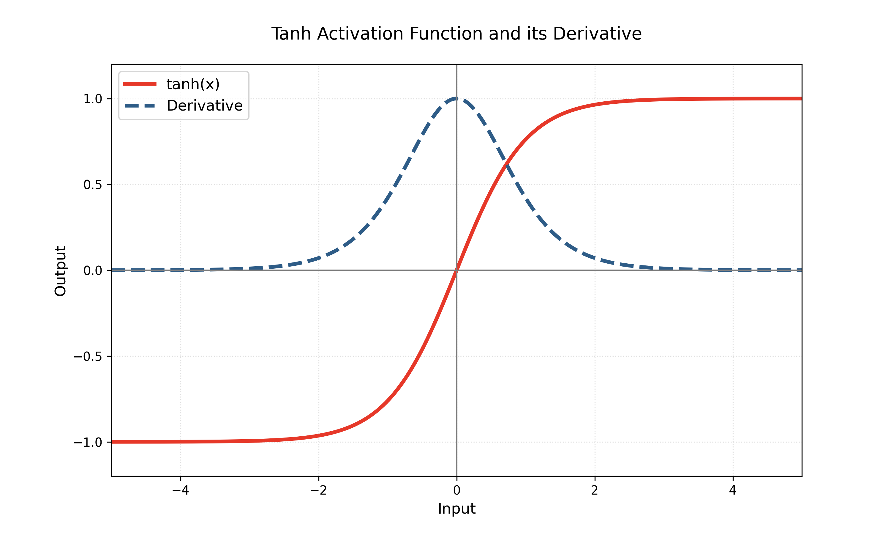

## 提出背景

Tanh（双曲正切）激活函数是Sigmoid函数的改进版本，提出动机主要为了解决**Sigmoid函数输出非零中心化**的问题。在Sigmoid函数中，输出值范围为$(0,1)$，导致后续层输入的均值偏移（非零中心），使得神经网络在反向传播时参数更新效率降低。

## 函数定义与特点
### 数学形式
$$
\text{tanh}(x) = \frac{e^x - e^{-x}}{e^x + e^{-x}} = 2\sigma(2x) - 1
$$
其中$\sigma(\cdot)$为Sigmoid函数

### 核心特点

1. ​**输出范围**：$(-1, 1)$，零中心化输出。

2. ​**可导性**：处处可导，适合梯度反向传播。

3. ​**饱和性**：当$|x| > 2$时梯度趋于0（梯度消失问题）。

4. ​**计算效率**：计算复杂度与Sigmoid相近。

## 梯度与反向传播

### 导数计算
$$
\frac{d}{dx}\text{tanh}(x) = 1 - \text{tanh}^2(x)
$$

### 反向传播过程

假设前向传播输出为$a = \text{tanh}(z)$，反向传播时：

1. 接收上游梯度$\frac{\partial L}{\partial a}$

2. 计算本地梯度：$\frac{\partial a}{\partial z} = 1 - a^2$

3. 传递梯度：$\frac{\partial L}{\partial z} = \frac{\partial L}{\partial a} \cdot (1 - a^2)$

**梯度更新数学描述**：

对于参数$w$和偏置$b$的梯度计算：
$$
\frac{\partial L}{\partial w} = \frac{\partial L}{\partial z} \cdot x,\quad 
\frac{\partial L}{\partial b} = \frac{\partial L}{\partial z}
$$
其中$x$为输入特征，$\frac{\partial L}{\partial z}$通过链式法则传播。

## 优缺点分析

### 优点

- 零中心输出加速梯度下降收敛。

- 比Sigmoid梯度更大（最大梯度为1，Sigmoid最大为0.25）。

- 可解释性：负值表示抑制，正值表示激活。

### 缺点

- 仍存在梯度消失问题（当输入绝对值较大时）。

- 计算量略大于ReLU系列函数。

- 需要谨慎的权重初始化（Xavier初始化常用）。

## 应用注意事项

1. 更适合RNN、LSTM等需要正负输出的场景。

2. 与批归一化（BatchNorm）配合使用可缓解梯度消失。

3. 初始学习率通常设置比ReLU更小（建议0.01-0.1）。

4. 现代深度学习中使用频率低于ReLU，但在时序模型中仍有重要地位。

## 与其他函数对比
| 特征   | Tanh    | Sigmoid | ReLU   |
| ---- | ------- | ------- | ------ |
| 输出范围 | (-1, 1) | (0, 1)  | [0, ∞) |
| 零中心化 | ✔️      | ❌       | ❌      |
| 梯度消失 | 中度      | 严重      | 低（正区间） |
| 计算速度 | 中等      | 中等      | 快      |

> ​**应用示例**：LSTM中常用tanh作为候选状态生成函数：
> $$ C_t' = \text{tanh}(W_c \cdot [h_{t-1}, x_t] + b_c) $$