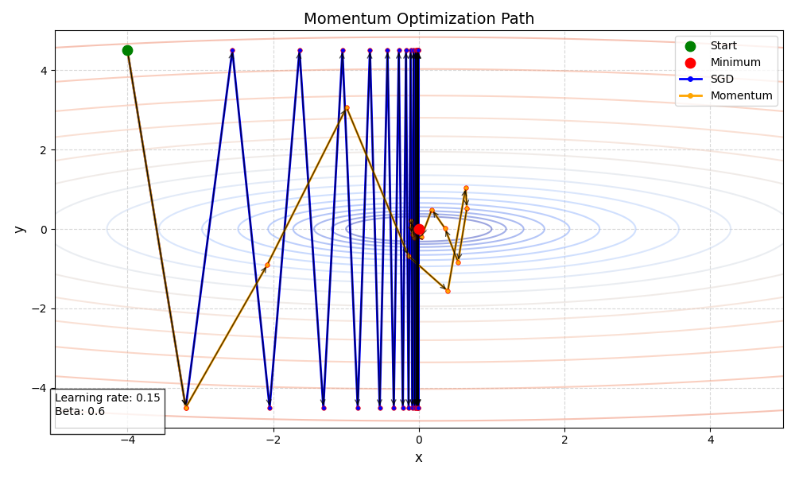
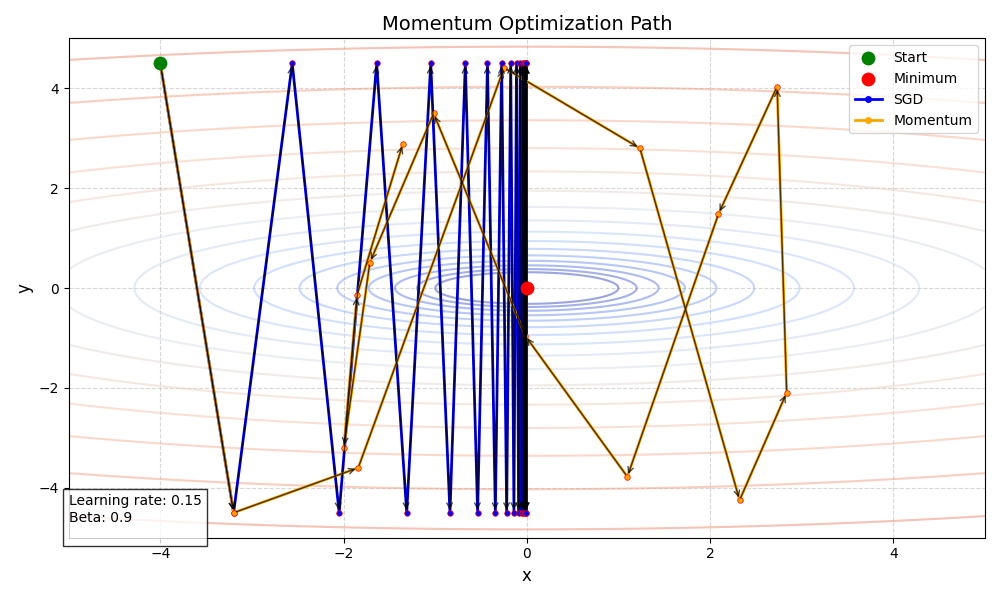

## 原理

**动量梯度下降（Momentum Gradient Descent）** 是一种优化算法，通过引入**动量项**来加速梯度下降过程。其核心思想是：  
- 在更新参数时，不仅考虑当前梯度，还累积历史梯度的加权平均。  
- 类似于物理中的动量，使参数更新方向在惯性方向上更稳定，减少震荡。

## 梯度更新

1. **动量项计算**： 

引入动量变量 $v_t$，表示历史梯度的指数加权平均：
$$v_t = \beta v_{t-1} + (1 - \beta) \nabla_\theta J(\theta)$$
其中 $\beta$ 是动量系数（通常取 0.9），$\nabla_\theta J(\theta)$ 是当前梯度。

2. **参数更新**：

使用动量项替代原始梯度进行更新：
$$\theta = \theta - \eta v_t$$
其中 $\eta$ 是学习率。

## 示例

假设目标函数是$x^2 + 10*y^2$，初始坐标$(-4,4.5)$，学习率$0.1$，动量系数$0.6$，下表列出8个时间步的梯度更新结果：

| 时间步 | SGD梯度 (x,y)         | Momentum梯度 (v_x,v_y) |
| --- | ------------------- | -------------------- |
| 0   | (-8.0000, 90.0000)  | (-8.0000, 90.0000)   |
| 1   | (-6.4000, -90.0000) | (-11.2000, -18.0000) |
| 2   | (-5.1200, 90.0000)  | (-10.0800, 43.2000)  |
| 3   | (-4.0960, -90.0000) | (-7.4368, -30.5280)  |
| 4   | (-3.2768, 90.0000)  | (-4.8748, 34.3872)   |
| 5   | (-2.6214, -90.0000) | (-2.9999, -25.2557)  |
| 6   | (-2.0972, 90.0000)  | (-1.7000, 28.4034)   |
| 7   | (-1.6777, -90.0000) | (-0.9200, -19.9620)  |
可以看出SGD以缓慢且震荡的方式向原点接近，而Momentum则快速且平滑。一开始Momentum的梯度较小是因为我们设定的初始动量为0。
## 优点

1. **加速收敛**：在梯度方向一致的维度上累积动量，加快收敛速度。  

2. **减少震荡**：通过动量平滑梯度方向，减少参数更新的震荡。  

3. **逃离局部极小值**：动量可能帮助跳出局部极小值或鞍点。

## 缺点

1. **超参数敏感**：需手动调整 $\beta$ 和学习率 $\eta$。  

2. **过冲风险**：动量过大可能导致参数更新越过最优解，产生震荡。

3. **非自适应**：对所有参数使用相同的学习率，可能不如自适应优化算法（如 Adam）灵活。