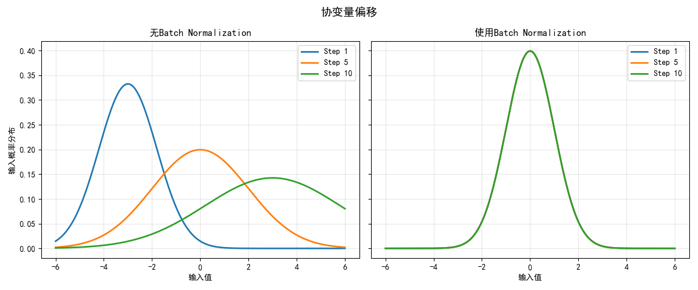
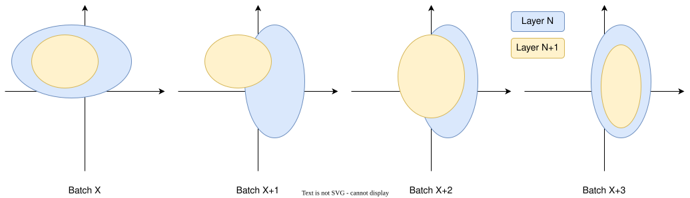
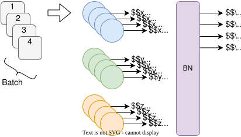

## 背景介绍

在深度神经网络训练中，**内部协变量偏移（Internal Covariate Shift）** 是一个常见问题：随着网络参数更新，各层的输入分布会发生变化，导致训练过程不稳定，需要更低的学习率和精细的参数初始化。2015年提出的**Batch Normalization（BN）** 通过标准化每层的输入分布，缓解了这一问题，显著加速了训练收敛，并允许使用更大的学习率。

## 原理细节

随着训练的进行，权重参数不断被更新，隐藏层输入的分布也会出现变化，导致相同的学习率作用在不同的特征会产生不同步的梯度变化，这会使得训练产生震荡。这时需要较小的学习率，但会导致训练速度变慢。

同时数据分布变化也会影响到后面的层，使得后面的层需要花更多轮来适应前面层输出的变化，最终导致整个网络收敛速度变慢。Batch Normalization可以使得输入输出的分布相对固定，这样可以让网络尽快收敛。

训练过程中，某些参数随着训练逐渐进入非线性饱和函数的饱和区间，梯度逐渐消失。通过Batch Normalization，可以将数据稳定分布在饱和函数的非饱和区间来缓解梯度消失问题。不过如果使用ReLU作为激活函数，这个不再是问题。

### 归一化步骤

假设归一化层的输入中包含某一特征$x$，批中所有样本的$x$特征的集合$\mathcal{B}=\{x_1,x_2,...,x_m\}$，BN按以下步骤处理：

1. **计算均值与方差**：
$$\mu_\mathcal{B} = \frac{1}{m}\sum_{i=1}^m x_i$$
$$\sigma_\mathcal{B}^2 = \frac{1}{m}\sum_{i=1}^m (x_i - \mu_\mathcal{B})^2$$

2. **标准化**：
$$\hat{x_i} = \frac{x_i - \mu_\mathcal{B}}{\sqrt{\sigma_\mathcal{B}^2 + \epsilon}}$$
   其中$\epsilon$是为数值稳定性添加的小常数（如$10^{-5}$）。

### 缩放与平移

这种标准化（均值为0，标准差为1的正态分布）会忽略输入的偏置并将输入压缩到固定区间，这样会改变模型的表达内容。因此引入可学习的参数$\gamma$（缩放因子）和$\beta$（平移因子），恢复模型的表达能力：
$$y_i = \gamma \hat{x_i} + \beta$$

### 训练与测试差异

- **训练阶段**：使用当前mini-batch的统计量$\mu_\mathcal{B}$和$\sigma_\mathcal{B}^2$。

- **测试阶段**：使用全局统计量（通常为训练时移动平均的$\mu_{\text{pop}}$和$\sigma_{\text{pop}}^2$）。

## 梯度计算与反向传播

BN的反向传播需考虑$\mu_\mathcal{B}$和$\sigma_\mathcal{B}^2$对输入的依赖。设损失函数为$L$，梯度计算如下：

1. **对$\gamma$和$\beta$的梯度**：
$$\frac{\partial L}{\partial \gamma} = \sum_{i=1}^m \frac{\partial L}{\partial y_i} \hat{x_i}, \quad \frac{\partial L}{\partial \beta} = \sum_{i=1}^m \frac{\partial L}{\partial y_i}$$

2. **对输入$x_i$的梯度**：
$$\frac{\partial L}{\partial x_i} = \frac{\gamma}{\sqrt{\sigma_\mathcal{B}^2 + \epsilon}} \left( \frac{\partial L}{\partial y_i} - \frac{1}{m}\sum_{j=1}^m \frac{\partial L}{\partial y_j} - \frac{\hat{x_i}}{m}\sum_{j=1}^m \frac{\partial L}{\partial y_j} \hat{x_j} \right)$$

## 优点

3. **加速训练**：允许使用更大的学习率，减少训练时间。

4. **降低对初始化的敏感度**：缓解梯度消失/爆炸问题。

5. **正则化效果**：mini-batch的噪声带来轻微正则化，可减少Dropout依赖。

## 缺点

6. **依赖Batch Size**：小批量下统计量估计不准确，影响性能。

7. **RNN适配复杂**：不同时间步需独立维护统计量，增加计算负担。（其实基本无法使用）。

8. **测试-训练不一致性**：移动平均的统计量可能与实际数据分布存在偏差。