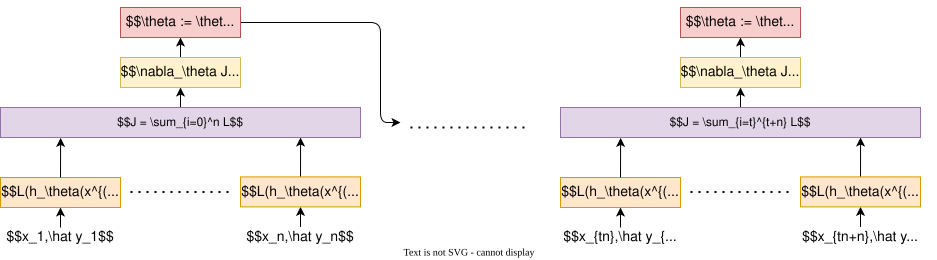

## ​原理

小批量梯度下降结合了批量梯度下降（BGD）和随机梯度下降（SGD）的优点：
- ​**BGD**：使用整个数据集计算梯度，方向准确但计算开销大。  
- ​**SGD**：每次用一个样本更新参数，计算快但噪声大、稳定性差。  

Mini-batch每次使用一个小批量（mini-batch）样本计算梯度，平衡效率与稳定性。

## ​参数更新

### 损失函数
$$J_t(\theta) =\frac{1}{n} \sum_{i=x}^{x+n} L(\theta_t; x^i, \hat {y^i})$$
- $n$：每一个批次的批量大小。
- $t$：批次。

### 参数更新  
$$
  \theta_{t,j} = \theta_{t,j} - \eta \cdot \nabla J_t(\theta_t)
  $$
  - $\eta$：学习率（控制参数更新步长）  
  - $\nabla J$：基于当前小批量数据的平均梯度。
  - $j$：参数索引（$\theta_j$表示第$j$个参数）。

## ​**算法步骤**

1. ​**初始化参数**
	- 随机初始化模型参数 $\theta$，设定学习率 $\eta$ 和批量大小 $n$。  

2. ​**数据分块**
	- 将训练集划分为多个小批量（每个含 $n$ 个样本）。  

3. ​**迭代更新**：  
	- 打乱数据顺序（避免周期性偏差）。  
	- 遍历每个小批量数据：  
		- 计算当前小批量的损失梯度之和。  
		- 按梯度方向更新参数。  

4. ​**重复遍历**
	- 多次遍历整个数据集（每个遍历称为一个epoch），直到模型收敛。

## ​**优点和缺点**

### 优点​  

- ​**计算高效**
	- 利用GPU并行加速小批量计算。  
- ​**梯度稳定**
	- 噪声比SGD小，样本分布更均匀，收敛更平稳。  
- ​**内存友好**
	- 比BGD的内存占用更低。  

### 缺点
​
- ​**需手动调参**：
	- 批量大小和学习率需反复实验。 

> ​**批量大小调整方法**：  
> - 从32/64开始尝试，逐步增加（需权衡内存和收敛速度）。  
> - 大批量（如1024）适合分布式训练。  

- ​**局部最优风险**：
	- 非凸优化中可能陷入局部极小值。  
