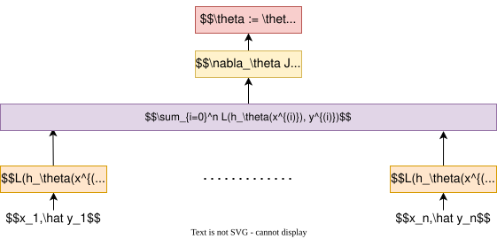

## 原理

在深度学习中，批量梯度下降是一种优化算法，用于最小化损失函数$J(\theta)$，其中$\theta$代表模型参数。其基本思想是利用整个训练集的梯度来更新模型参数。

## 参数更新

### 损失函数

在批量梯度下降时，损失函数为训练集上所有样本的损失值之和除以样本个数：
$$J(\theta) = \frac{1}{n} \sum_{i=0}^n L(\theta; x^i, \hat {y^i}) $$
- $n$：数据集的总大小。

### 参数更新

为了最小化损失函数$J$，我们需要根据它的梯度来调整参数 $\theta$。在批量梯度下降算法中，使用该梯度更新规则迭代地调整参数 $\theta_j$ 直到收敛：
$$ \theta_j := \theta_j - \eta \cdot \nabla_{\theta_j} J(\theta) $$
- $\eta$：学习率。
- $\nabla_{\theta_j} J(\theta)$：目标函数第$j$个参数的梯度。

## 优点和缺点

### **优点**

- **全局最优解**
	- 对于凸误差曲面或准凸函数，BGD能够收敛到全局最优解；
	- 对于非凸函数，则可能收敛到局部最优解。
- **稳定收敛**
	- 由于每次更新都基于整个数据集，因此每次更新都非常稳定，导致**平滑的收敛**过程。
- **方向精确性**
    - 使用所有训练样本计算梯度，能够更准确地估计损失函数的下降方向，**减少噪声干扰**，收敛路径更稳定。
- **易于并行化**
    - 由于需要处理所有样本，可以通过矩阵运算并行化计算梯度，提升计算效率。

### **缺点**

- **计算成本高**
	- 需要计算整个训练集的梯度，这在大规模数据集上是非常昂贵的。
- **计算效率低**
	- 尤其是在大数据集上，因为每次迭代都需要遍历整个数据集，所以BGD的迭代速度相对较慢。
- **无法在线学习**
    - 无法实时更新模型参数，必须等待所有数据处理完毕才能进行一次迭代，不适用于动态数据或实时场景。
- **内存占用高**
    - 需要将**整个训练数据集加载到内存**中。
    - 也可以分批计算损失，累加后一次性进行梯度更新，但实现上很少使用。