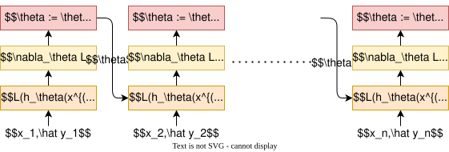

## 原理

**随机梯度下降（Stochastic Gradient Descent, SGD）** 是一种优化算法，它通过逐个样本更新参数，而不是使用整个数据集计算梯度。这样可以大大提高计算效率，尤其是在大规模数据集的情况下。

## 参数更新

### 梯度计算

与批量梯度下降（BGD）不同，SGD 在每次迭代中只使用一个样本来计算梯度。对于训练集中的每个样本 $(x^{(i)}, y^{(i)})$，更新过程如下：

1. 计算该样本的梯度： 
$$\nabla_\theta L(h_\theta(x^{(i)}), y^{(i)})$$
   其中 $L$ 是损失函数，$h_\theta(x^{(i)})$ 是模型的预测。

2. 在 SGD 中，梯度更新的公式是基于每个单独样本计算的。对于每个样本 $(x^{(i)}, y^{(i)})$，我们根据损失函数的梯度更新模型参数：
$$\theta := \theta - \eta \nabla_\theta L(h_\theta(x^{(i)}), y^{(i)})$$
   其中，$\eta$ 是学习率， $\nabla_\theta L(h_\theta(x^{(i)}), y^{(i)})$ 是损失函数对参数 $\theta$ 的偏导数。

## 优点和缺点

### 优点

- **计算效率高**
	- SGD 每次只使用一个样本计算梯度，极大地减少了计算的负担，适用于大规模数据集。
- **能够跳出局部最优**
	- 由于每次更新是基于单个样本，参数更新过程中会引入一定的“噪声”，这使得 SGD 有可能避免局部最优解，接近全局最优。
- **内存占用小**
	- 每次只处理一个样本，内存需求相对较低，适合内存资源有限的情况。
- **适用于在线学习**
    - **实时更新**：可逐样本处理数据，支持动态数据流和实时训练场景。

### 缺点

- **更新不稳定**
	- 由于每次梯度的计算基于单个样本，梯度更新存在很大的波动性，导致参数更新路径不稳定，可能需要更多的迭代才能收敛。
- **收敛速度慢**
	- 虽然每次更新都较快，但因为更新路径的波动，收敛过程较慢，可能需要较长时间才能接近最优解。
- **依赖于学习率选择**
	- SGD 对学习率非常敏感，选择不合适的学习率会导致算法难以收敛或收敛到局部最优。

