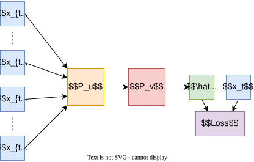
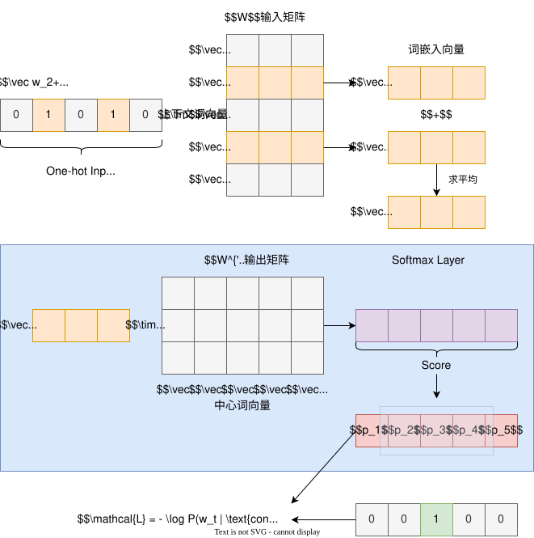
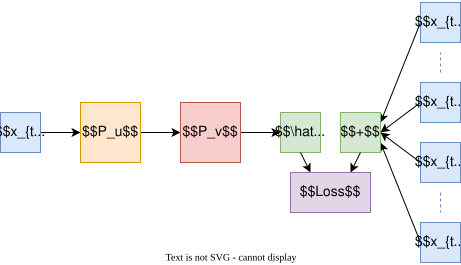

## 核心思想

Word2Vec是一种通过无监督学习获取词汇向量表示的算法，核心假设是**分布相似性**：语义相似的词会出现在相似的上下文中。其目标是将单词映射到低维稠密向量空间，使得：
$$similarity(w_i, w_j) \approx \vec{v}_{w_i} \cdot \vec{v}_{w_j}$$

## 模型架构

### 1. CBOW (Continuous Bag-of-Words)

- 通过上下文预测中心词

- 目标函数：最大化对数似然
$$\mathcal{L} = \sum_{t=1}^T \log p(w_t | w_{t-k}, ..., w_{t+k})$$

#### 上下文词向量与中心词向量

在 CBOW 模型中，​**每个词**对应两种向量表示：

- ​**上下文词向量（Context Word Vector）​**：当词作为上下文词时，其对应的向量。记为 $\mathbf{v}_w$，其中 $w$ 表示词的索引。

- ​**中心词向量（Center Word Vector）​**：当词作为中心词（目标词）时，其对应的向量。记为 $\mathbf{u}_c$，其中 $c$ 表示中心词的索引。

#### 输入矩阵与输出矩阵

CBOW 模型通过两个矩阵定义词向量：

- ​**输入矩阵（Input Matrix）​**：记为 $W \in \mathbb{R}^{V \times d}$，其中 $V$ 是词汇表大小，$d$ 是向量维度。矩阵的**每一行**对应一个词的上下文词向量。例如，词 $w$ 的上下文词向量为 $\mathbf{v}_w = W[w,:] \in \mathbb{R}^d$。

- ​**输出矩阵（Output Matrix）​**：记为 $W' \in \mathbb{R}^{d \times V}$，矩阵的**每一列**对应一个词的中心词向量。例如，词 $c$ 的中心词向量为 $\mathbf{u}_c = W'[:,c] \in \mathbb{R}^d$。

#### 计算过程

给定一个上下文窗口大小为 $C$ 的词序列，CBOW 的目标是通过上下文词预测中心词。具体步骤如下：

1. ​**获取上下文词向量**  
   对窗口内的所有上下文词 $\{w_{t-C}, ..., w_{t-1}, w_{t+1}, ..., w_{t+C}\}$，从输入矩阵 $W$ 中提取向量 $\mathbf{v}_{t+j}$，并计算均值：  
$$
   \mathbf{\hat{v}} = \frac{1}{2C} \sum_{-C \leq j \leq C, j \neq 0} \mathbf{v}_{t+j}
   $$

2. ​**计算中心词得分**  
   对每个可能的中心词 $w_c$，计算其与上下文词均值向量的相似度得分：  
$$
   \text{score}(w_c | \text{context}) = \mathbf{\hat{v}}^T \mathbf{u}_c = \sum_{k=1}^d \hat{v}_k \cdot u_{c,k}
   $$

3. ​**Softmax 归一化**  
   将得分转换为概率分布：  
$$
   P(w_c | \text{context}) = \frac{\exp(\mathbf{\hat{v}}^T \mathbf{u}_c)}{\sum_{k=1}^V \exp(\mathbf{\hat{v}}^T \mathbf{u}_k)}
   $$

下图演示了词汇表大小为5，词嵌入维度为3时CBOW的计算流程：

> 在实际实现中，输出矩阵就是Softmax的权重矩阵。

#### 损失函数
CBOW 使用**负对数似然损失函数**。对每个上下文窗口和对应的中心词 $w_t$，损失函数定义为：  
$$
\mathcal{L} = -\frac{1}{T} \sum_{t=1}^T \log P(w_t | \text{context})
$$  
其中：
- $T$ 是训练文本的总词数。
- 外层求和表示对所有中心词求平均。

### 2. Skip-gram

#### 简介

- 通过中心词预测上下文

- 更擅长处理低频词

- 目标函数：
$$\mathcal{L} = \sum_{t=1}^T \sum_{-k \leq j \leq k, j \neq 0} \log p(w_{t+j} | w_t)$$

#### 中心词向量与上下文词向量

在 SkipGram 模型中，​**每个词**对应两种向量表示：

- ​**中心词向量（Center Word Vector）​**：当词作为中心词时，其对应的向量。记为 $\mathbf{v}_w$，其中 $w$ 表示词的索引。

- ​**上下文词向量（Context Word Vector）​**：当词作为上下文词时，其对应的向量。记为 $\mathbf{u}_c$，其中 $c$ 表示上下文词的索引。

#### 输入矩阵与输出矩阵

SkipGram 模型通过两个矩阵定义词向量：

- ​**输入矩阵（Input Matrix）​**：记为 $W \in \mathbb{R}^{V \times d}$，其中 $V$ 是词汇表大小，$d$ 是向量维度。矩阵的**每一行**对应一个词的中心词向量。例如，词 $w$ 的中心词向量为 $\mathbf{v}_w = W[w,:] \in \mathbb{R}^d$。中心词向量就是对应单词的词嵌入。

- ​**输出矩阵（Output Matrix）​**：记为 $W' \in \mathbb{R}^{d \times V}$，矩阵的**每一列**对应一个词的上下文词向量。例如，词 $c$ 的上下文词向量为 $\mathbf{u}_c = W'[:,c] \in \mathbb{R}^d$。

#### 计算过程

给定一个中心词 $w_t$ 和上下文窗口大小 $C$，SkipGram 的目标是计算窗口内上下文词的条件概率。具体步骤如下：

1. ​**获取中心词向量**  
   通过输入矩阵 $W$ 得到中心词 $w_t$ 的向量 $\mathbf{v}_t = W[w_t,:] \in \mathbb{R}^d$。

2. ​**计算上下文词得分**  
   对每个可能的上下文词 $w_c$，计算其与中心词的相似度得分：  
$$
   \text{score}(w_c | w_t) = \mathbf{v}_t^T \mathbf{u}_c = \sum_{k=1}^d v_{t,k} \cdot u_{c,k}
$$

3. ​**Softmax 归一化**  
   将得分转换为概率分布：  
$$
   P(w_c | w_t) = \frac{\exp(\mathbf{v}_t^T \mathbf{u}_c)}{\sum_{k=1}^V \exp(\mathbf{v}_t^T \mathbf{u}_k)}
   $$

下图演示了词汇表大小为5，词嵌入维度为3时SkipGram的计算流程：

#### 损失函数

SkipGram 使用**负对数似然损失函数**。对每个中心词 $w_t$ 和上下文窗口内的所有上下文词 $\{w_{t+j} | -C \leq j \leq C, j \neq 0\}$，损失函数定义为：  
$$
\mathcal{L} = -\frac{1}{T} \sum_{t=1}^T \sum_{-C \leq j \leq C, j \neq 0} \log P(w_{t+j} | w_t)
$$  
其中：
- $T$ 是训练文本的总词数。
- 内层求和表示对上下文窗口内的每个词计算负对数概率。
- 外层求和表示对所有中心词求平均。

## 关键优化技术

### 1. 层次Softmax

- 使用霍夫曼树编码词频

- 时间复杂度从$O(|V|)$降为$O(\log |V|)$

- 节点概率计算：
$$p(path(n(w), j)) = \sigma(\vec{v}_n^T \cdot \vec{h})$$

### 2. 负采样 (Negative Sampling)

- 用噪声对比估计替代softmax

- 目标函数变为：
$$\log \sigma(\vec{v}_o^T \vec{h}) + \sum_{k=1}^K \mathbb{E}_{w_k \sim P_n}[\log \sigma(-\vec{v}_{w_k}^T \vec{h})]$$

## 参数设置

- 向量维度：通常100-500维

- 窗口大小：5-10

- 负样本数：5-20

## 优缺点

**优点**：

- 高效训练。

- 捕获语义规律。

**局限**：

- 无法处理一词多义.

- 上下文窗口固定。

> 通过分布式表示突破传统one-hot编码的维度灾难，为NLP带来里程碑式进展。

