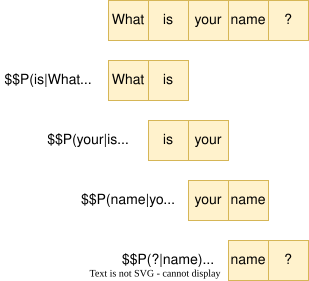

## N-gram 原理

### 基本概念

N-gram 是基于统计的语言模型，通过计算文本中连续出现的 n 个词语（token）的联合概率来预测语言序列。其核心假设为 ​**马尔可夫假设**：当前词的概率仅依赖于前 n-1 个词。

### 数学表示

对于句子 $W = w_1, w_2, ..., w_m$，其概率计算为：
$$P(W) = \prod_{i=1}^{m} P(w_i | w_{i-n+1}^{i-1})$$
- ​**Unigram (1-gram)**: $P(w_i)$
- ​**Bigram (2-gram)**: $P(w_i | w_{i-1})$
- ​**Trigram (3-gram)**: $P(w_i | w_{i-2}, w_{i-1})$

2-gram图示：

### 训练过程

1. ​**统计词频**：计算语料库中每个 n-gram 的出现次数。

2. ​**概率估计**：使用最大似然估计（MLE）。
$$P(w_i | w_{i-n+1}^{i-1}) = \frac{C(w_{i-n+1}^{i})}{C(w_{i-n+1}^{i-1})}$$

## 平滑技术

解决零概率问题（单词表中未出现单词）。

### 加一平滑（Laplace）

- ​**原理**：所有 n-gram 计数加 1

- ​**公式**：
$$P_{add1}(w_i | w_{i-n+1}^{i-1}) = \frac{C(w_{i-n+1}^{i}) + 1}{C(w_{i-n+1}^{i-1}) + V}$$
  - $V$：词汇表大小

  - 缺点：
	  - 所有未出现的n-gram被赋予完全相同的概率（即加1后的固定值），而实际中不同未出现n-gram的潜在概率可能差异很大。
	  - 加一平滑对所有n-gram（无论是否出现）统一调整，未考虑不同n-gram的统计特性。

### Good-Turing 平滑

- ​**核心思想**：用出现 r 次的 n-gram 数量估计出现 r+1 次的概率。

- ​**调整公式**：
$$P_{GT} = \frac{(r+1) \cdot N_{r+1}}{N_r \cdot N}$$
  - $N_r$：出现 r 次的 n-gram 数量

### Kneser-Ney 平滑

- ​**创新点**：考虑词语的上下文多样性。

- ​**公式**：
$$P_{KN}(w_i | w_{i-n+1}^{i-1}) = \frac{max(C(w_{i-n+1}^{i}) - D, 0)}{C(w_{i-n+1}^{i-1})} + \lambda \cdot P_{continuation}(w_i)$$
  - $D$：折扣系数（通常 0.75）
  - $\lambda$：归一化因子

### 方法对比
| 方法          | 优点         | 缺点         |
| ----------- | ---------- | ---------- |
| 加一平滑        | 实现简单       | 高维数据效果差    |
| Good-Turing | 自适应调整低频词概率 | 需要精确统计 N_r |
| Kneser-Ney  | 处理OOV效果最佳  | 计算复杂度高     |

## 选词策略

+ 贪心搜索（Greedy Search）

+ 束搜索（Beam Search）

+ Top-k 采样

+ Nucleus 采样（Top-p）

## 优缺点分析

### 优势

1. ​**计算高效**：基于统计无需复杂训练。

2. ​**可解释性强**：概率计算透明。

3. ​**小数据友好**：适合资源受限场景。

### 局限性

1. ​**数据稀疏**：高阶n-gram需要海量语料。

2. ​**上下文限制**：无法捕捉长距离依赖。

3. ​**泛化能力弱**：无法处理未见语言模式。
