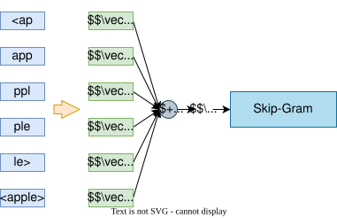

## 核心思想

FastText的核心思想是**利用子词(subword)信息**构建词向量。与传统词嵌入模型（如Word2Vec）不同，FastText将每个词表示为**其所有子词向量之和**，从而更好地处理罕见词、拼写错误和形态丰富的语言。

## 子词生成方式

- ​**n-gram子词**：对单词生成固定长度（如3-6）的字符级n-gram。

- ​**边界符号**：在单词前后添加`<`和`>`符号以区分前缀和后缀。例如，`apple`变为`<apple>`，生成3-gram子词：`<ap`, `app`, `ppl`, `ple`, `le>`。

- ​**保留完整词**：将整个单词也作为子词之一，确保常见词有独立向量。

- **随机初始化**：每个子词向量都是随机初始化的，并且在训练阶段通过反向传播进行更新，使得相关子词的表示更符合语料中的分布规律。。

- **合理性**
	- **线性可加性**：子词向量的和保留了局部特征（词缀、词根）与全局特征（完整词）。
	- **共享表示**：`unhappy`和`happy`会共享`happy`子词的向量。
	- **降维效果**：$\mathbb{R}^{|G_w|×d} \rightarrow \mathbb{R}^d$。
## 网络结构

FastText采用与**Skip-Gram**相似的架构，但输入层使用子词向量之和。

### 输入层

- 对于词$w$，其子词集合为$G_w$，每个子词$g \in G_w$对应向量$\mathbf{v}_g \in \mathbb{R}^d$。

- 词向量$\mathbf{w}$计算方式：  
$$\mathbf{w} = \sum_{g \in G_w} \mathbf{v}_g$$

### 隐藏层

- 直接使用输入层向量$\mathbf{w}$作为隐藏层输出（无激活函数），维度为$d$。

### 输出层

FastText的输出仍然是传统Skip-Gram中的上下文词向量，并不包含子词。

- ​**层次Softmax**：通过霍夫曼树将计算复杂度从$O(|V|)$降低到$O(\log |V|)$，其中$V$为词汇表。

- ​**负采样**：对负样本采样近似Softmax，目标函数为：  
$$\log \sigma(\mathbf{c} \cdot \mathbf{w}) + \sum_{i=1}^k \mathbb{E}_{c_i \sim P_n} \log \sigma(-\mathbf{c_i} \cdot \mathbf{w})$$
  其中$\mathbf{c}$为上下文向量，$k$为负样本数，$\sigma$为Sigmoid函数。

## 损失函数

**Skip-Gram目标函数**：最大化上下文词的条件概率  
$$J(\theta) = \frac{1}{T} \sum_{t=1}^T \sum_{-m \leq j \leq m, j \neq 0} \log P(c_{t+j} | w_t)$$
其中$P(c|w)$通过子词向量计算：  
$$P(c|w) = \frac{\exp(\mathbf{w} \cdot \mathbf{c})}{\sum_{c' \in V} \exp(\mathbf{w} \cdot \mathbf{c'})}$$

## 关键设计细节

1. ​**共享子词向量**：不同词的相同子词共享相同的词向量，提升数据利用率。

2. ​**可变长度n-gram**：默认使用3-6 gram，平衡局部特征和计算效率。

3. ​**高频词过滤**：类似Word2Vec，采用Subsampling技术减少高频词的影响。

## 优点和缺点

- **优点**
	- 可处理OOV词（未登录词）。
	- 对形态丰富的语言效果更好（比如法语）。
	- 通过子词共享提升小数据集泛化能力。

- **缺点**
	- 存储开销较大（需存储所有子词向量）。
	- 长词的计算成本较高，需要频繁查表。
	- 对短词（n < gram长度）不友好。

