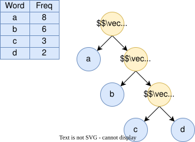
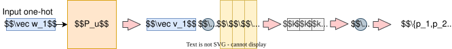
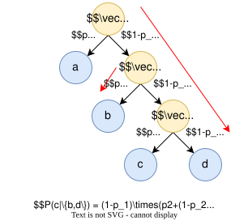

## 利用哈夫曼树优化

### 核心优化原理

霍夫曼编码在Word2vec的**层次Softmax**中发挥核心作用，通过构建词频加权的最短路径二叉树，将原始softmax的$O(|V|)$复杂度降为$O(\log |V|)$。其优化主要体现在：
1. ​**高频词短路径**：出现频率高的词位于浅层节点。
2. ​**低频词长路径**：低频词分布在深层叶子节点。
3. ​**参数更新局部化**：每次只更新路径上的节点参数。

### 具体实现步骤

#### 霍夫曼树构建

- 根据语料库词频分布构建二叉树。

- 合并策略：始终合并当前最小权重的两个节点（最底层的两个叶子节点）。

#### 节点编码规则
$$
\begin{aligned}
&\text{left child} \rightarrow \text{code }0 \\
&\text{right child} \rightarrow \text{code }1 \\
&\text{path code} = \{0,1\}^L \quad (L = \text{tree depth})
\end{aligned}
$$

#### 参数映射

- 每个非叶子节点对应一个参数向量$\vec u_n \in \mathbb{R}^d$。
	- CBOW中的中心词向量或者SkipGram中的上下文词向量被替换为参数向量$\vec u_n$。

- 叶子节点对应词one-hot向量$\vec w_n \in \mathbb{R}^d$。

### 条件概率计算

对于中心词$w$的上下文词$c$，首先通过非叶子节点的参数向量$\vec u_n$计算各个非叶子节点两个分支的概率：
$$P_{k} = \sigma(\vec u_{n(c,k)}^\top v_w )$$

$$
p(c|w) = \prod_{k=1}^{L(c)-1} \sigma( \{ \text{code}(c,k+1)=1 \} \cdot \vec u_{n(c,k)}^\top v_w )
$$

其中：
- $L(c)$: 词c的路径长度
- $\text{code}(c,k)$: 路径上第k个节点的编码(0/1)
- $\sigma$: sigmoid函数

### 反向传播优化

每次仅更新路径上的参数：
1. 对路径长度$L$进行链式求导
2. 参数更新量：
$$
\Delta \theta_k = \eta (1-\sigma(\theta_k^\top v_w)-d)\cdot v_w
$$
其中$d\in\{0,1\}$是当前节点的目标编码

### 优势分析
| 对比维度       | 原始Softmax | 霍夫曼优化 |
|----------------|-------------|------------|
| 时间复杂度      | $O(V)$      | $O(\log V)$|
| 高频词计算效率   | 无差别       | 提升5-10倍 |
| 内存占用        | 存储$V$个词向量 | 增加$(V-1)$个节点向量 |

> 实验表明，在10万词规模的语料上，训练速度可提升20-50倍，且对高频词的语义捕捉更精准

## 负采样优化

### 核心思想

负采样是一种用于**高效训练词向量**的优化方法，主要解决传统Softmax在大型语料库中计算成本高的问题。通过以下方式优化：
- 将多分类问题转化为二分类问题。
- ​**仅更新正样本和少量负样本**的参数，而非全部词汇表。
- 适用于Skip-Gram等模型。

### 数学原理

#### 原始Softmax

传统概率计算：
$$P(w_o|w_c) = \frac{\exp(u_o^T v_c)}{\sum_{k=1}^V \exp(u_k^T v_c)}$$
其中$V$为词汇表大小，计算复杂度$O(V)$

#### 负采样优化

改进后的目标函数：
$$\log \sigma(u_o^T v_c) + \sum_{k=1}^K \mathbb{E}_{w_k \sim P_n(w)}[\log \sigma(-u_k^T v_c)]$$
其中：
- $\sigma$为sigmoid函数
- $K$为负样本数量（通常5-20）
- $P_n(w)$为负样本采样分布

### 采样策略

### 常用采样分布

1. ​**加权采样**：按词频的3/4次方采样
$$P(w_i) = \frac{f(w_i)^{3/4}}{\sum_j f(w_j)^{3/4}}$$
2. ​**均匀采样**：简单但效果较差

### 采样特点

- 高频词被采样概率更高
- 3/4次方平滑了极端频率差异
- 比均匀采样效果提升约2-3倍

### 与其他方法对比
| 方法 | 计算复杂度 | 更新参数 | 适用场景 |
|------|------------|----------|----------|
| 原始Softmax | O(V) | 全参数 | 小词汇表 |
| 层次Softmax | O(logV) | 路径参数 | 中等规模 |
| ​**负采样** | O(K+1) | 采样参数 | 大规模数据 |

### 实际应用

1. 在Word2Vec中的典型应用：
   - 将10^5量级的计算降为10^1量级
   - 加速比可达100-1000倍

2. 扩展应用：
   - 推荐系统（BPR算法）
   - 图嵌入（Node2Vec）
   - 序列推荐

### 参数选择建议

- 负样本数量K：一般取5-20
- 小数据集：建议较大K值（15-20）
- 大数据集：建议较小K值（2-5）
- 最佳值需通过验证集确定

### 理论依据

负采样本质上是**噪声对比估计（NCE）​**的简化版本，通过：
$$ \frac{p(D=1|w,c)}{p(D=0|w,c)} = \frac{p(w|c)}{q(w)} $$
其中$q(w)$是噪声分布，当$K=|V|-1$时等价于原始Softmax。

# 负采样优化过程与损失函数推导

## 一、优化过程详解

### 1. 训练样本构造

- ​**输入**：中心词$w_c$与上下文词$w_o$组成正样本对。

- ​**采样策略**：从噪声分布$P_n(w)$中采样$K$个负样本$\{w_1,...,w_K\}$。

- ​**典型配置**：K=5时，每个训练样本包含：
  - 1个正样本
  - 5个随机负样本

### 2. 参数更新步骤

1. ​**前向传播**：
   - 计算正样本得分：$\sigma(u_o^T v_c)$
   - 计算负样本得分：$\sigma(-u_k^T v_c), k=1..K$  
   （负样本的标签为0，故取负号）

2. ​**反向传播**：
   - ​**仅更新**：
     - 中心词向量$v_c$
     - 正样本词向量$u_o$
     - K个负样本词向量$\{u_1,...,u_K\}$

3. ​**参数更新公式**：
$$ v_c := v_c + \eta[ (1-\sigma(u_o^T v_c))u_o - \sum_{k=1}^K \sigma(u_k^T v_c)u_k ] $$
$$ u_o := u_o + \eta[ (1-\sigma(u_o^T v_c))v_c ] $$
$$ u_k := u_k - \eta[ \sigma(u_k^T v_c)v_c ], \quad k=1..K $$

## 二、损失函数推导

### 1. 原始Softmax问题

对于给定中心词$w_c$，预测上下文词$w_o$的概率：
$$ P(w_o|w_c) = \frac{\exp(u_o^T v_c)}{\sum_{k=1}^V \exp(u_k^T v_c)} $$
最大似然估计需要计算整个词汇表（复杂度$O(V)$）

### 2. 二分类转化
将问题转化为二分类任务：
- ​**正样本**：$(w_c, w_o) \sim P(D=1|w_c,w_o)$
- ​**负样本**：$(w_c, w_k) \sim P(D=0|w_c,w_k)$

使用sigmoid函数建模：
$$ P(D=1|w,c) = \sigma(u_w^T v_c) = \frac{1}{1+\exp(-u_w^T v_c)} $$

### 3. 损失函数构建
目标函数由两部分组成：
- 最大化正样本对数似然
- 最小化负样本对数似然

**单个样本损失**：
$$ \mathcal{L} = \log \sigma(u_o^T v_c) + \sum_{k=1}^K \log \sigma(-u_k^T v_c) $$

### 4. 全数据集损失函数
对全体训练样本取期望：
$$ \mathcal{J} = \sum_{(w_c,w_o)} \left[ \log \sigma(u_o^T v_c) + \sum_{k=1}^K \mathbb{E}_{w_k \sim P_n} \log \sigma(-u_k^T v_c) \right] $$

### 5. 与NCE的联系
当满足以下条件时，负采样等价于噪声对比估计：
- 负样本数$K \to \infty$
- 噪声分布$P_n(w)$与真实分布匹配

此时目标函数收敛于：
$$ \mathcal{J} = \mathbb{E} \left[ \log \frac{P(w_o|w_c)}{P(w_o|w_c) + KP_n(w_o)} \right] $$

## 三、关键数学推导步骤
1. ​**Sigmoid导数**：
   $$ \frac{d}{dx}\log\sigma(x) = 1 - \sigma(x) $$
   $$ \frac{d}{dx}\log\sigma(-x) = -\sigma(x) $$

2. ​**参数梯度计算**：
   - 对$v_c$的梯度：
     $$ \frac{\partial \mathcal{L}}{\partial v_c} = [1-\sigma(u_o^T v_c)]u_o - \sum_{k=1}^K \sigma(u_k^T v_c)u_k $$

   - 对$u_o$的梯度：
     $$ \frac{\partial \mathcal{L}}{\partial u_o} = [1-\sigma(u_o^T v_c)]v_c $$

   - 对$u_k$的梯度：
     $$ \frac{\partial \mathcal{L}}{\partial u_k} = -\sigma(u_k^T v_c)v_c $$

3. ​**更新量分析**：
   - 正样本参数被加强：$+[1-\sigma(u_o^T v_c)]\eta$
   - 负样本参数被削弱：$-\sigma(u_k^T v_c)\eta$